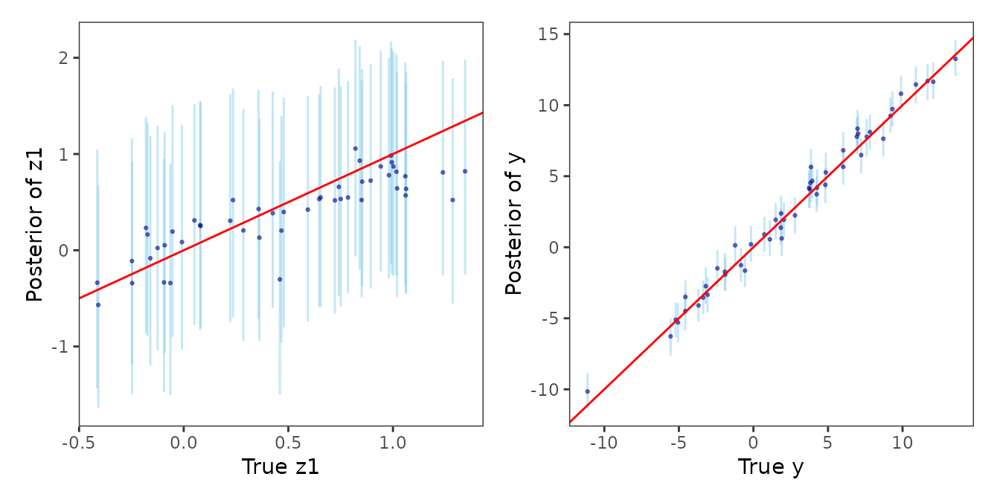
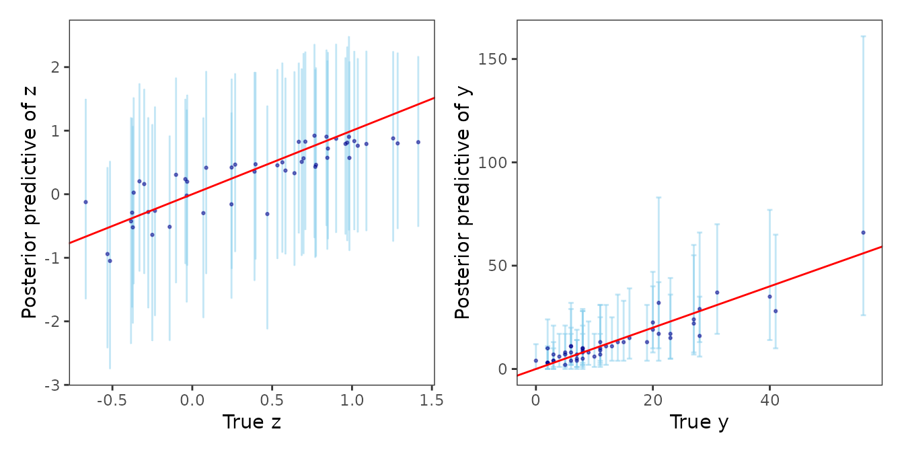
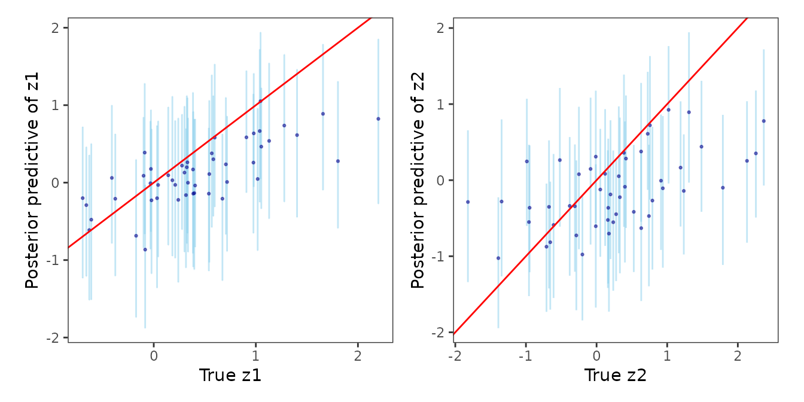

# Posterior Predictive Inference

In this article, we discuss the function -

- [`posteriorPredict()`](https://span-18.github.io/spStack-dev/reference/posteriorPredict.md)

This function can be used to obtain posterior predictive inference at
unobserved locations in space or time. It is applied on the output of
functions
[`spLMexact()`](https://span-18.github.io/spStack-dev/reference/spLMexact.md),
[`spLMstack()`](https://span-18.github.io/spStack-dev/reference/spLMstack.md),
[`spGLMexact()`](https://span-18.github.io/spStack-dev/reference/spGLMexact.md),
[`spGLMstack()`](https://span-18.github.io/spStack-dev/reference/spGLMstack.md),
[`stvcGLMexact()`](https://span-18.github.io/spStack-dev/reference/stvcGLMexact.md),
[`stvcGLMstack()`](https://span-18.github.io/spStack-dev/reference/stvcGLMstack.md)
etc.

``` r
library(spStack)
library(ggplot2)
library(patchwork)
set.seed(1729)
```

The `joint` argument in
[`posteriorPredict()`](https://span-18.github.io/spStack-dev/reference/posteriorPredict.md)
indicates if the predictions at the new locations or times are to be
made based on the joint posterior predictive distribution or not. If
`joint=FALSE`, then the individual predictions are made from their
corresponding posterior predictive distributions.

## Prediction in spatial linear model

Define the collection of candidate parameters and fit the model using
[`spLMstack()`](https://span-18.github.io/spStack-dev/reference/spLMstack.md).

``` r
# training and test data sizes
n_train <- 150
n_pred <- 50

data("simGaussian")
dat_train <- simGaussian[1:n_train, ]
dat_pred <- simGaussian[n_train + 1:n_pred, ]

mod1 <- spLMstack(y ~ x1, data = dat_train,
                  coords = as.matrix(dat_train[, c("s1", "s2")]),
                  cor.fn = "matern",
                  params.list = list(phi = c(1.5, 3, 5),
                                     nu = c(0.75, 1.25),
                                     noise_sp_ratio = c(0.5, 1, 2)),
                  n.samples = 1000, loopd.method = "psis",
                  parallel = FALSE, verbose = TRUE)
```

    ## --------------------------------------------------

    ## Solver diagnostics:

    ## Installed solvers: CLARABEL, SCS, OSQP, HIGHS

    ## Requested solver: DEFAULT (CLARABEL -> ECOS -> SCS)

    ## Solver search order: CLARABEL -> SCS

    ## --------------------------------------------------

    ## ────────────────────────────────── CVXR v1.8.1 ─────────────────────────────────

    ## ℹ Problem: 1 variable, 2 constraints (DCP)

    ## ℹ Compilation: "CLARABEL" via CVXR::FlipObjective -> CVXR::Dcp2Cone -> CVXR::CvxAttr2Constr -> CVXR::ConeMatrixStuffing -> CVXR::Clarabel_Solver

    ## ℹ Compile time: 0.793s

    ## ─────────────────────────────── Numerical solver ───────────────────────────────

    ## ──────────────────────────────────── Summary ───────────────────────────────────

    ## ✔ Status: optimal

    ## ✔ Optimal value: -85.5234

    ## ℹ Compile time: 0.793s

    ## ℹ Solver time: 0.029s

    ## 
    ## STACKING WEIGHTS:
    ## 
    ##            | phi | nu   | noise_sp_ratio | weight |
    ## +----------+-----+------+----------------+--------+
    ## | Model 1  |  1.5|  0.75|             0.5| 0.72   |
    ## | Model 2  |  3.0|  0.75|             0.5| 0.00   |
    ## | Model 3  |  5.0|  0.75|             0.5| 0.28   |
    ## | Model 4  |  1.5|  1.25|             0.5| 0.00   |
    ## | Model 5  |  3.0|  1.25|             0.5| 0.00   |
    ## | Model 6  |  5.0|  1.25|             0.5| 0.00   |
    ## | Model 7  |  1.5|  0.75|             1.0| 0.00   |
    ## | Model 8  |  3.0|  0.75|             1.0| 0.00   |
    ## | Model 9  |  5.0|  0.75|             1.0| 0.00   |
    ## | Model 10 |  1.5|  1.25|             1.0| 0.00   |
    ## | Model 11 |  3.0|  1.25|             1.0| 0.00   |
    ## | Model 12 |  5.0|  1.25|             1.0| 0.00   |
    ## | Model 13 |  1.5|  0.75|             2.0| 0.00   |
    ## | Model 14 |  3.0|  0.75|             2.0| 0.00   |
    ## | Model 15 |  5.0|  0.75|             2.0| 0.00   |
    ## | Model 16 |  1.5|  1.25|             2.0| 0.00   |
    ## | Model 17 |  3.0|  1.25|             2.0| 0.00   |
    ## | Model 18 |  5.0|  1.25|             2.0| 0.00   |
    ## +----------+-----+------+----------------+--------+

Define the new coordinates, run
[`posteriorPredict()`](https://span-18.github.io/spStack-dev/reference/posteriorPredict.md),
and finally sample from the *stacked posterior*.

``` r
sp_pred <- as.matrix(dat_pred[, c("s1", "s2")])
X_new <- as.matrix(cbind(rep(1, n_pred), dat_pred$x1))
mod.pred <- posteriorPredict(mod1, coords_new = sp_pred, covars_new = X_new, joint = TRUE)
post_samps <- stackedSampler(mod.pred)
```

Finally, we analyze the posterior predictive distributions of the
spatial process as well as the responses against their corresponding
true values in order to assess how well the predictions are made.

``` r
postpred_z <- post_samps$z.pred
post_z_summ <- t(apply(postpred_z, 1, function(x) quantile(x, c(0.025, 0.5, 0.975))))
z_combn <- data.frame(z = dat_pred$z_true, zL = post_z_summ[, 1],
                      zM = post_z_summ[, 2], zU = post_z_summ[, 3])
plot_z_summ <- ggplot(data = z_combn, aes(x = z)) +
  geom_errorbar(aes(ymin = zL, ymax = zU), alpha = 0.5, color = "skyblue") +
  geom_point(aes(y = zM), size = 0.5, color = "darkblue", alpha = 0.5) +
  geom_abline(slope = 1, intercept = 0, color = "red", linetype = "solid") +
  xlab("True z1") + ylab("Posterior of z1") + theme_bw() +
  theme(panel.grid = element_blank(), aspect.ratio = 1)

postpred_y <- post_samps$y.pred
post_y_summ <- t(apply(postpred_y, 1, function(x) quantile(x, c(0.025, 0.5, 0.975))))
y_combn <- data.frame(y = dat_pred$y, yL = post_y_summ[, 1],
                      yM = post_y_summ[, 2], yU = post_y_summ[, 3])

plot_y_summ <- ggplot(data = y_combn, aes(x = y)) +
  geom_errorbar(aes(ymin = yL, ymax = yU), alpha = 0.5, color = "skyblue") +
  geom_point(aes(y = yM), size = 0.5, color = "darkblue", alpha = 0.5) +
  geom_abline(slope = 1, intercept = 0, color = "red", linetype = "solid") +
  xlab("True y") + ylab("Posterior of y") + theme_bw() +
  theme(panel.grid = element_blank(), aspect.ratio = 1)

plot_z_summ + plot_y_summ
```



## Prediction in spatial generalized linear model

Define the collection of candidate parameters and fit the model using
[`spGLMstack()`](https://span-18.github.io/spStack-dev/reference/spGLMstack.md).
We use spatial Poisson count data `simPoisson` for this example.

``` r
# training and test data sizes
n_train <- 150
n_pred <- 50

# load spatial Poisson data
data("simPoisson")
dat_train <- simPoisson[1:n_train, ]
dat_pred <- simPoisson[n_train + 1:n_pred, ]

mod1 <- spGLMstack(y ~ x1, data = dat_train, family = "poisson",
                   coords = as.matrix(dat_train[, c("s1", "s2")]), cor.fn = "matern",
                   params.list = list(phi = c(3, 4, 5), nu = c(0.5, 1.0),
                                      boundary = c(0.5)),
                   priors = list(nu.beta = 5, nu.z = 5),
                   n.samples = 1000,
                   loopd.controls = list(method = "CV", CV.K = 10, nMC = 500),
                   verbose = TRUE)
```

    ## Some priors were not supplied. Using defaults.

    ## --------------------------------------------------

    ## Solver diagnostics:

    ## Installed solvers: CLARABEL, SCS, OSQP, HIGHS

    ## Requested solver: DEFAULT (CLARABEL -> ECOS -> SCS)

    ## Solver search order: CLARABEL -> SCS

    ## --------------------------------------------------

    ## ────────────────────────────────── CVXR v1.8.1 ─────────────────────────────────

    ## ℹ Problem: 1 variable, 2 constraints (DCP)

    ## ℹ Compilation: "CLARABEL" via CVXR::FlipObjective -> CVXR::Dcp2Cone -> CVXR::CvxAttr2Constr -> CVXR::ConeMatrixStuffing -> CVXR::Clarabel_Solver

    ## ℹ Compile time: 0.235s

    ## ─────────────────────────────── Numerical solver ───────────────────────────────

    ## ──────────────────────────────────── Summary ───────────────────────────────────

    ## ✔ Status: optimal

    ## ✔ Optimal value: -236.802

    ## ℹ Compile time: 0.235s

    ## ℹ Solver time: 0.043s

    ## 
    ## STACKING WEIGHTS:
    ## 
    ##           | phi | nu  | boundary | weight |
    ## +---------+-----+-----+----------+--------+
    ## | Model 1 |    3|  0.5|       0.5| 0.000  |
    ## | Model 2 |    4|  0.5|       0.5| 0.000  |
    ## | Model 3 |    5|  0.5|       0.5| 0.000  |
    ## | Model 4 |    3|  1.0|       0.5| 0.079  |
    ## | Model 5 |    4|  1.0|       0.5| 0.000  |
    ## | Model 6 |    5|  1.0|       0.5| 0.921  |
    ## +---------+-----+-----+----------+--------+

Define the new coordinates, run
[`posteriorPredict()`](https://span-18.github.io/spStack-dev/reference/posteriorPredict.md),
and finally sample from the *stacked posterior*. To demonstrate the
usage, we specify `joint=FALSE` for the prediction task.

``` r
sp_pred <- as.matrix(dat_pred[, c("s1", "s2")])
X_new <- as.matrix(cbind(rep(1, n_pred), dat_pred$x1))
mod.pred <- posteriorPredict(mod1, coords_new = sp_pred, covars_new = X_new, joint = FALSE)
post_samps <- stackedSampler(mod.pred)
```

Finally, we analyze the posterior predictive distributions of the
spatial process as well as the responses against their corresponding
true values in order to assess how well the predictions are made.

``` r
postpred_z <- post_samps$z.pred
post_z_summ <- t(apply(postpred_z, 1, function(x) quantile(x, c(0.025, 0.5, 0.975))))
z_combn <- data.frame(z = dat_pred$z_true, zL = post_z_summ[, 1],
                      zM = post_z_summ[, 2], zU = post_z_summ[, 3])

plot_z_summ <- ggplot(data = z_combn, aes(x = z)) +
  geom_errorbar(aes(ymin = zL, ymax = zU), alpha = 0.5, color = "skyblue") +
  geom_point(aes(y = zM), size = 0.5, color = "darkblue", alpha = 0.5) +
  geom_abline(slope = 1, intercept = 0, color = "red", linetype = "solid") +
  xlab("True z") + ylab("Posterior predictive of z") + theme_bw() +
  theme(panel.grid = element_blank(), aspect.ratio = 1)

postpred_y <- post_samps$y.pred
post_y_summ <- t(apply(postpred_y, 1, function(x) quantile(x, c(0.025, 0.5, 0.975))))
y_combn <- data.frame(y = dat_pred$y, yL = post_y_summ[, 1],
                      yM = post_y_summ[, 2], yU = post_y_summ[, 3])

plot_y_summ <- ggplot(data = y_combn, aes(x = y)) +
  geom_errorbar(aes(ymin = yL, ymax = yU), alpha = 0.5, color = "skyblue") +
  geom_point(aes(y = yM), size = 0.5, color = "darkblue", alpha = 0.5) +
  geom_abline(slope = 1, intercept = 0, color = "red", linetype = "solid") +
  xlab("True y") + ylab("Posterior predictive of y") + theme_bw() +
  theme(panel.grid = element_blank(), aspect.ratio = 1)

plot_z_summ + plot_y_summ
```



## Prediction in spatially-temporally varying coefficients model

Define the collection of candidate parameters and fit the model using
[`stvcGLMstack()`](https://span-18.github.io/spStack-dev/reference/stvcGLMstack.md).
We use spatial Poisson count data `sim_stvcPoisson` for this example.

``` r
# Example 2: Spatial-temporal model with varying coefficients
n_train <- 150
n_pred <- 50
data("sim_stvcPoisson")
dat <- sim_stvcPoisson[1:(n_train + n_pred), ]

# split dataset into test and train
dat_train <- dat[1:n_train, ]
dat_pred <- dat[n_train + 1:n_pred, ]

# create list of candidate models (multivariate)
mod.list2 <- candidateModels(list(phi_s = list(1, 2, 3),
                                  phi_t = list(1, 2, 4),
                                  boundary = c(0.5, 0.75)), "cartesian")

# fit a spatial-temporal varying coefficient model using predictive stacking
mod1 <- stvcGLMstack(y ~ x1 + (x1), data = dat_train, family = "poisson",
                     sp_coords = as.matrix(dat_train[, c("s1", "s2")]),
                     time_coords = as.matrix(dat_train[, "t_coords"]),
                     cor.fn = "gneiting-decay",
                     process.type = "multivariate",
                     candidate.models = mod.list2,
                     loopd.controls = list(method = "CV", CV.K = 10, nMC = 500),
                     n.samples = 500)
```

    ## --------------------------------------------------

    ## Solver diagnostics:

    ## Installed solvers: CLARABEL, SCS, OSQP, HIGHS

    ## Requested solver: DEFAULT (CLARABEL -> ECOS -> SCS)

    ## Solver search order: CLARABEL -> SCS

    ## --------------------------------------------------

    ## ────────────────────────────────── CVXR v1.8.1 ─────────────────────────────────

    ## ℹ Problem: 1 variable, 2 constraints (DCP)

    ## ℹ Compilation: "CLARABEL" via CVXR::FlipObjective -> CVXR::Dcp2Cone -> CVXR::CvxAttr2Constr -> CVXR::ConeMatrixStuffing -> CVXR::Clarabel_Solver

    ## ℹ Compile time: 0.049s

    ## ─────────────────────────────── Numerical solver ───────────────────────────────

    ## ──────────────────────────────────── Summary ───────────────────────────────────

    ## ✔ Status: optimal

    ## ✔ Optimal value: -484.461

    ## ℹ Compile time: 0.049s

    ## ℹ Solver time: 0.011s

    ## 
    ## STACKING WEIGHTS:
    ## 
    ##            | phi_s | phi_t | boundary | weight |
    ## +----------+-------+-------+----------+--------+
    ## | Model 1  |      1|      1|      0.50| 0.000  |
    ## | Model 2  |      2|      1|      0.50| 0.000  |
    ## | Model 3  |      3|      1|      0.50| 0.152  |
    ## | Model 4  |      1|      2|      0.50| 0.000  |
    ## | Model 5  |      2|      2|      0.50| 0.000  |
    ## | Model 6  |      3|      2|      0.50| 0.172  |
    ## | Model 7  |      1|      4|      0.50| 0.000  |
    ## | Model 8  |      2|      4|      0.50| 0.000  |
    ## | Model 9  |      3|      4|      0.50| 0.339  |
    ## | Model 10 |      1|      1|      0.75| 0.000  |
    ## | Model 11 |      2|      1|      0.75| 0.000  |
    ## | Model 12 |      3|      1|      0.75| 0.000  |
    ## | Model 13 |      1|      2|      0.75| 0.000  |
    ## | Model 14 |      2|      2|      0.75| 0.000  |
    ## | Model 15 |      3|      2|      0.75| 0.000  |
    ## | Model 16 |      1|      4|      0.75| 0.000  |
    ## | Model 17 |      2|      4|      0.75| 0.000  |
    ## | Model 18 |      3|      4|      0.75| 0.336  |
    ## +----------+-------+-------+----------+--------+

Define the new coordinates, run
[`posteriorPredict()`](https://span-18.github.io/spStack-dev/reference/posteriorPredict.md),
and finally sample from the *stacked posterior*. We use `joint=FALSE`
for this particular example.

``` r
# prepare new coordinates and covariates for prediction
sp_pred <- as.matrix(dat_pred[, c("s1", "s2")])
tm_pred <- as.matrix(dat_pred[, "t_coords"])
X_new <- as.matrix(cbind(rep(1, n_pred), dat_pred$x1))
mod_pred <- posteriorPredict(mod1,
                             coords_new = list(sp = sp_pred, time = tm_pred),
                             covars_new = list(fixed = X_new, vc = X_new),
                             joint = FALSE)

# sample from the stacked posterior and posterior predictive distribution
post_samps <- stackedSampler(mod_pred)
```

Finally, we analyze the posterior predictive distributions of the
spatial-temporal process by plotting them against their corresponding
true values.

``` r
postpred_z <- post_samps$z.pred
post_z1_summ <- t(apply(postpred_z[1:n_pred,], 1,
                        function(x) quantile(x, c(0.025, 0.5, 0.975))))
post_z2_summ <- t(apply(postpred_z[n_pred + 1:n_pred,], 1,
                        function(x) quantile(x, c(0.025, 0.5, 0.975))))

z1_combn <- data.frame(z = dat_pred$z1_true, zL = post_z1_summ[, 1],
                       zM = post_z1_summ[, 2], zU = post_z1_summ[, 3])
z2_combn <- data.frame(z = dat_pred$z2_true, zL = post_z2_summ[, 1],
                       zM = post_z2_summ[, 2], zU = post_z2_summ[, 3])

plot_z1_summ <- ggplot(data = z1_combn, aes(x = z)) +
  geom_errorbar(aes(ymin = zL, ymax = zU), alpha = 0.5, color = "skyblue") +
  geom_point(aes(y = zM), size = 0.5, color = "darkblue", alpha = 0.5) +
  geom_abline(slope = 1, intercept = 0, color = "red", linetype = "solid") +
  xlab("True z1") + ylab("Posterior predictive of z1") + theme_bw() +
  theme(panel.grid = element_blank(), aspect.ratio = 1)

plot_z2_summ <- ggplot(data = z2_combn, aes(x = z)) +
  geom_errorbar(aes(ymin = zL, ymax = zU), alpha = 0.5, color = "skyblue") +
  geom_point(aes(y = zM), size = 0.5, color = "darkblue", alpha = 0.5) +
  geom_abline(slope = 1, intercept = 0, color = "red", linetype = "solid") +
  xlab("True z2") + ylab("Posterior predictive of z2") + theme_bw() +
  theme(panel.grid = element_blank(), aspect.ratio = 1)

plot_z1_summ + plot_z2_summ
```


