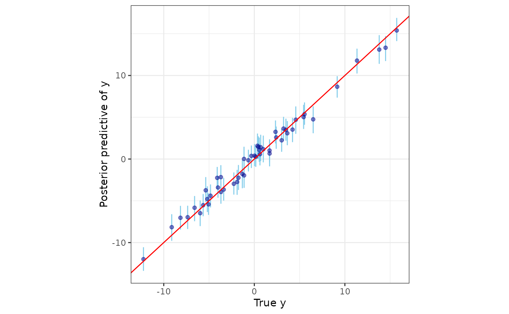
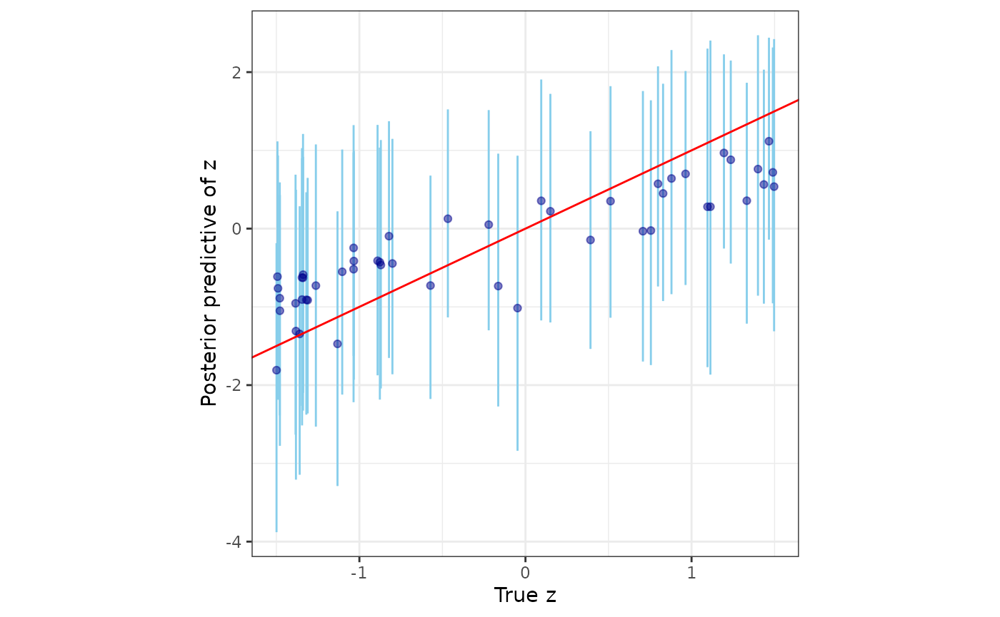

# spStack: Bayesian Geostatistics Using Predictive Stacking

spStack implements Bayesian inference for a rich class of spatial and
spatial-temporal geostatistical models using stacking of predictive
densities. Besides delivering competitive predictive performance as
compared to traditional fully Bayesian inference using MCMC, predictive
stacking is embarrassingly parallel, and hence, fast. This package, to
the best of our knowledge, is the first to implement stacking for
Bayesian analysis of spatial and spatial-temporal data. Technical
details surrounding the methodology can be found in the articles Zhang
et al. ([2025](#ref-zhang2024stacking)) and Pan et al.
([2025](#ref-pan2024stacking)).

``` r

set.seed(1729)
```

## Bayesian Gaussian spatial regression models

Here is a quick example using the Gaussian response `y_gauss` of the
lazyloaded synthetic data `simSpatial`, observed at 500 locations in the
unit square with two covariates `x1` and `x2` and a spatial effect
`z_true` with a ripple pattern (see
[`?simSpatial`](https://span-18.github.io/spStack-dev/reference/simSpatial.md)).

**Step 1.** Load the library spStack and prepare the data. Here we split
the data into `dat_train` and `dat_pred` - we train our model on
`dat_train` and subsequently carry out posterior predictive inference at
the locations in `dat_pred`.

``` r

library(spStack)

# training and test data sizes
n_train <- 100
n_pred <- 50

data("simSpatial")
dat_train <- simSpatial[1:n_train, ]
dat_pred <- simSpatial[n_train + 1:n_pred, ]
```

**Step 2.** Run the function
[`spLMstack()`](https://span-18.github.io/spStack-dev/reference/spLMstack.md) -
define the model with a formula, input the spatial coordinates as a
matrix, specify the correlation function, and accordingly provide
candidate models through `candidate.models`. The argument `loopd.method`
can be used to specify the method used for calculation of leave-one-out
predictive densities, existing parallelization plan can be used if
`parallel` is set `TRUE`, and `solver` argument specifies the solver
used to carry out the optimization routine to get stacking weights.

``` r

cand.mod <- candidateModels(list(phi = c(3, 6, 10),
                                 nu = c(0.5, 1),
                                 noise_sp_ratio = c(0.5, 1, 2)),
                            "cartesian")

mod1 <- spLMstack(y_gauss ~ x1 + x2, data = dat_train,
                  coords = as.matrix(dat_train[, c("s1", "s2")]),
                  cor.fn = "matern",
                  candidate.models = cand.mod,
                  n.samples = 1000, loopd.method = "psis",
                  parallel = FALSE, verbose = TRUE)
#> 
#> STACKING WEIGHTS:
#> 
#>            | phi | nu  | noise_sp_ratio | weight |
#> +----------+-----+-----+----------------+--------+
#> | Model 1  |    3|  0.5|             0.5| 0      |
#> | Model 2  |    6|  0.5|             0.5| 0      |
#> | Model 3  |   10|  0.5|             0.5| 0      |
#> | Model 4  |    3|  1.0|             0.5| 0      |
#> | Model 5  |    6|  1.0|             0.5| 0      |
#> | Model 6  |   10|  1.0|             0.5| 1      |
#> | Model 7  |    3|  0.5|             1.0| 0      |
#> | Model 8  |    6|  0.5|             1.0| 0      |
#> | Model 9  |   10|  0.5|             1.0| 0      |
#> | Model 10 |    3|  1.0|             1.0| 0      |
#> | Model 11 |    6|  1.0|             1.0| 0      |
#> | Model 12 |   10|  1.0|             1.0| 0      |
#> | Model 13 |    3|  0.5|             2.0| 0      |
#> | Model 14 |    6|  0.5|             2.0| 0      |
#> | Model 15 |   10|  0.5|             2.0| 0      |
#> | Model 16 |    3|  1.0|             2.0| 0      |
#> | Model 17 |    6|  1.0|             2.0| 0      |
#> | Model 18 |   10|  1.0|             2.0| 0      |
#> +----------+-----+-----+----------------+--------+
#> 
#> ----------------------------------------
#>  Diagnostics
#> ----------------------------------------
#> Model 1 (stacking weight 0):
#>   - 8 of 100 Pareto k diagnostic values exceed 0.67: the PSIS estimates of
#>     the corresponding leave-one-out predictive densities may be unreliable;
#>     consider loopd.method = 'exact'.
#> Model 2 (stacking weight 0):
#>   - 16 of 100 Pareto k diagnostic values exceed 0.67: the PSIS estimates of
#>     the corresponding leave-one-out predictive densities may be unreliable;
#>     consider loopd.method = 'exact'.
#> Model 3 (stacking weight 0):
#>   - 29 of 100 Pareto k diagnostic values exceed 0.67: the PSIS estimates of
#>     the corresponding leave-one-out predictive densities may be unreliable;
#>     consider loopd.method = 'exact'.
#> Model 4 (stacking weight 0):
#>   - 4 of 100 Pareto k diagnostic values exceed 0.67: the PSIS estimates of
#>     the corresponding leave-one-out predictive densities may be unreliable;
#>     consider loopd.method = 'exact'.
#> Model 5 (stacking weight 0):
#>   - 4 of 100 Pareto k diagnostic values exceed 0.67: the PSIS estimates of
#>     the corresponding leave-one-out predictive densities may be unreliable;
#>     consider loopd.method = 'exact'.
#> Model 6 (stacking weight 1):
#>   - 19 of 100 Pareto k diagnostic values exceed 0.67: the PSIS estimates of
#>     the corresponding leave-one-out predictive densities may be unreliable;
#>     consider loopd.method = 'exact'.
#> Model 7 (stacking weight 0):
#>   - 1 of 100 Pareto k diagnostic values exceed 0.67: the PSIS estimates of
#>     the corresponding leave-one-out predictive densities may be unreliable;
#>     consider loopd.method = 'exact'.
#> Model 8 (stacking weight 0):
#>   - 7 of 100 Pareto k diagnostic values exceed 0.67: the PSIS estimates of
#>     the corresponding leave-one-out predictive densities may be unreliable;
#>     consider loopd.method = 'exact'.
#> Model 9 (stacking weight 0):
#>   - 11 of 100 Pareto k diagnostic values exceed 0.67: the PSIS estimates of
#>     the corresponding leave-one-out predictive densities may be unreliable;
#>     consider loopd.method = 'exact'.
#> Model 10 (stacking weight 0):
#>   - 1 of 100 Pareto k diagnostic values exceed 0.67: the PSIS estimates of
#>     the corresponding leave-one-out predictive densities may be unreliable;
#>     consider loopd.method = 'exact'.
#> Model 11 (stacking weight 0):
#>   - 4 of 100 Pareto k diagnostic values exceed 0.67: the PSIS estimates of
#>     the corresponding leave-one-out predictive densities may be unreliable;
#>     consider loopd.method = 'exact'.
#> Model 12 (stacking weight 0):
#>   - 7 of 100 Pareto k diagnostic values exceed 0.67: the PSIS estimates of
#>     the corresponding leave-one-out predictive densities may be unreliable;
#>     consider loopd.method = 'exact'.
#> Model 14 (stacking weight 0):
#>   - 1 of 100 Pareto k diagnostic values exceed 0.67: the PSIS estimates of
#>     the corresponding leave-one-out predictive densities may be unreliable;
#>     consider loopd.method = 'exact'.
#> Model 15 (stacking weight 0):
#>   - 3 of 100 Pareto k diagnostic values exceed 0.67: the PSIS estimates of
#>     the corresponding leave-one-out predictive densities may be unreliable;
#>     consider loopd.method = 'exact'.
#> Model 17 (stacking weight 0):
#>   - 1 of 100 Pareto k diagnostic values exceed 0.67: the PSIS estimates of
#>     the corresponding leave-one-out predictive densities may be unreliable;
#>     consider loopd.method = 'exact'.
#> Model 18 (stacking weight 0):
#>   - 2 of 100 Pareto k diagnostic values exceed 0.67: the PSIS estimates of
#>     the corresponding leave-one-out predictive densities may be unreliable;
#>     consider loopd.method = 'exact'.
#> ----------------------------------------
```

**Step 3.** Use the helper function
[`stackedSampler()`](https://span-18.github.io/spStack-dev/reference/stackedSampler.md)
to sample from the stacked posterior distribution. These samples serve
as the final posterior samples corresponding to our target model.

``` r

post_samps <- stackedSampler(mod1)
```

The final output will be a tagged list with each entry containing
posterior samples of the corresponding parameter.

``` r

post_beta <- post_samps$beta
summary_beta <- t(apply(post_beta, 1, function(x) quantile(x, c(0.025, 0.5, 0.975))))
rownames(summary_beta) <- mod1$X.names
print(summary_beta)
#>                  2.5%       50%     97.5%
#> (Intercept)  1.565441  2.002206  2.458732
#> x1           4.733082  4.861075  4.988097
#> x2          -1.140405 -1.002560 -0.861761
```

> **Note:** The following optional steps are only required if interested
> in posterior predictive inference.

**(Optional) Step 4.** Prepare the inputs for posterior predictive
inference. The new spatial coordinates at which we intend to carry out
prediction is given by `sp_pred` and the value of the covariates at
these new locations are given by `X_new`.

``` r

sp_pred <- as.matrix(dat_pred[, c("s1", "s2")])
X_new <- cbind(1, dat_pred$x1, dat_pred$x2)
```

**(Optional) Step 5.** Pass the output obtained by running
[`spLMstack()`](https://span-18.github.io/spStack-dev/reference/spLMstack.md)
through the function
[`posteriorPredict()`](https://span-18.github.io/spStack-dev/reference/posteriorPredict.md)
along with the new coordinates and covariates.

``` r

mod.pred <- posteriorPredict(mod1,
                             coords_new = sp_pred,
                             covars_new = X_new,
                             joint = TRUE)
```

**(Optional) Step 6.** Once samples from the posterior predictive
distribution are obtained, once again run
[`stackedSampler()`](https://span-18.github.io/spStack-dev/reference/stackedSampler.md)
to obtain samples from the *stacked* posterior predictive distribution.

``` r

postpred_samps <- stackedSampler(mod.pred)
```

Next, we analyze how well we predict the responses by plotting their
posterior predictive summaries against their corresponding true values.

``` r

postpred_y <- postpred_samps$y.pred
post_y_summ <- t(apply(postpred_y, 1, function(x) quantile(x, c(0.025, 0.5, 0.975))))
y_combn <- data.frame(y = dat_pred$y_gauss, yL = post_y_summ[, 1],
                      yM = post_y_summ[, 2], yU = post_y_summ[, 3])
library(ggplot2)
ggplot(data = y_combn, aes(x = y)) +
  geom_errorbar(aes(ymin = yL, ymax = yU), color = "skyblue") +
  geom_point(aes(y = yM), color = "darkblue", alpha = 0.5) +
  geom_abline(slope = 1, intercept = 0, color = "red", linetype = "solid") +
  xlab("True y") + ylab("Posterior predictive of y") + theme_bw() +
  theme(panel.background = element_blank(), aspect.ratio = 1)
```



More details about this can found in the vignettes titled “Spatial
Models” and “Posterior Predictive Inference”.

## Bayesian non-Gaussian spatial regression models

The workflow for the spatial generalized linear models are similar. Here
is a quick example using the Poisson response `y_pois` of the same data
`simSpatial`.

**Step 1.** Prepare data by splitting into train and test sets.

``` r

# training and test data sizes
n_train <- 100
n_pred <- 50

dat_train <- simSpatial[1:n_train, ]
dat_pred <- simSpatial[n_train + 1:n_pred, ]
```

**Step 2.** Run the function
[`spGLMstack()`](https://span-18.github.io/spStack-dev/reference/spGLMstack.md)
after specifying the `family`, and providing candidate models
constructed using
[`candidateModels()`](https://span-18.github.io/spStack-dev/reference/candidateModels.md).
The `loopd.controls` option can be used to specify the method and
parameters used for calculation of leave-one-out predictive densities.
The input `list(method = "CV", CV.K = 10, nMC = 500)` corresponds to
$`K`$-fold cross-validation with $`K = 10`$ and using 500 Monte Carlo
samples for calculating each predictive density.

``` r

cand.mod <- candidateModels(list(phi = c(3, 6, 10), nu = c(0.5, 1.0),
                                 boundary = c(0.5)), "cartesian")

mod1 <- spGLMstack(y_pois ~ x1 + x2, data = dat_train, family = "poisson",
                   coords = as.matrix(dat_train[, c("s1", "s2")]), cor.fn = "matern",
                   candidate.models = cand.mod,
                   priors = list(nu.beta = 5, nu.z = 5),
                   n.samples = 1000,
                   loopd.controls = list(method = "CV", CV.K = 10, nMC = 500),
                   verbose = TRUE)
#> Some priors were not supplied. Using defaults.
#> 
#> STACKING WEIGHTS:
#> 
#>           | phi | nu  | boundary | weight |
#> +---------+-----+-----+----------+--------+
#> | Model 1 |    3|  0.5|       0.5| 0      |
#> | Model 2 |    6|  0.5|       0.5| 0      |
#> | Model 3 |   10|  0.5|       0.5| 0      |
#> | Model 4 |    3|  1.0|       0.5| 0      |
#> | Model 5 |    6|  1.0|       0.5| 0      |
#> | Model 6 |   10|  1.0|       0.5| 1      |
#> +---------+-----+-----+----------+--------+
```

**Step 3.** Run
[`stackedSampler()`](https://span-18.github.io/spStack-dev/reference/stackedSampler.md)
to obtain posterior samples from the stacked posterior and then analyze
the output.

``` r

post_samps <- stackedSampler(mod1)

post_beta <- post_samps$beta
summary_beta <- t(apply(post_beta, 1, function(x) quantile(x, c(0.025, 0.5, 0.975))))
rownames(summary_beta) <- mod1$X.names
print(summary_beta)
#>                   2.5%        50%      97.5%
#> (Intercept)  1.0386174  1.7320419  2.4407602
#> x1          -0.7649680 -0.5416002 -0.3693263
#> x2           0.2099681  0.4461940  0.7626159
```

> **Note:** The following optional steps are only required if interested
> in posterior predictive inference.

**(Optional) Step 4.** Prepare the inputs for posterior predictive
inference.

``` r

sp_pred <- as.matrix(dat_pred[, c("s1", "s2")])
X_new <- cbind(1, dat_pred$x1, dat_pred$x2)
```

**(Optional) Step 5.** Finally, pass the model output through the
function
[`posteriorPredict()`](https://span-18.github.io/spStack-dev/reference/posteriorPredict.md)

``` r

mod.pred <- posteriorPredict(mod1,
                             coords_new = sp_pred,
                             covars_new = X_new,
                             joint = FALSE)
```

**(Optional) Step 6.** Once samples from the posterior predictive
distribution is obtained, obtain samples from the stacked posterior
predictive distribution using
[`stackedSampler()`](https://span-18.github.io/spStack-dev/reference/stackedSampler.md).

``` r

postpred_samps <- stackedSampler(mod.pred)
```

Further, we analyze the posterior predictive distribution of the spatial
process against their corresponding true values.

``` r

postpred_z <- postpred_samps$z.pred
post_z_summ <- t(apply(postpred_z, 1, function(x) quantile(x, c(0.025, 0.5, 0.975))))
z_combn <- data.frame(z = dat_pred$z_true, zL = post_z_summ[, 1],
                      zM = post_z_summ[, 2], zU = post_z_summ[, 3])
ggplot(data = z_combn, aes(x = z)) +
  geom_errorbar(aes(ymin = zL, ymax = zU), color = "skyblue") +
  geom_point(aes(y = zM), color = "darkblue", alpha = 0.5) +
  geom_abline(slope = 1, intercept = 0, color = "red", linetype = "solid") +
  xlab("True z") + ylab("Posterior predictive of z") + theme_bw() +
  theme(panel.background = element_blank(), aspect.ratio = 1)
```



## Additional functionalities

We have devised and demonstrated Bayesian predictive stacking to be an
effective tool for estimating spatial/spatial-temporal regression models
and yielding robust predictions for Gaussian as well as non-Gaussian
data. We develop and exploit analytically accessible distribution theory
pertaining to Bayesian analysis of linear mixed model and generalized
linear mixed models that enables us to directly sample from the
posterior distributions. The focus of this package is on effectively
combining inference across different closed-form posterior distributions
by circumventing inference on weakly identified parameters.

The “Technical Overview” vignette provides a comprehensive review of the
conjugate Bayesian hierarchical models used here. The “Spatial Models”
and “Spatial-Temporal Models” explains in detail how to use the
functions for spatial and spatial-temporal regressions, respectively.
Future developments and investigations will consider zero-inflated
non-Gaussian data and adapting to variants of Gaussian process models
that scale inference to massive datasets by circumventing the Cholesky
decomposition of dense covariance matrices.

## References

Pan, Soumyakanti, Lu Zhang, Jonathan R. Bradley, and Sudipto Banerjee.
2025. “Bayesian Inference for Spatial-Temporal Non-Gaussian Data Using
Predictive Stacking.” *Bayesian Analysis* (In press).
<https://doi.org/10.1214/25-BA1582>.

Zhang, Lu, Wenpin Tang, and Sudipto Banerjee. 2025. “Bayesian
Geostatistics Using Predictive Stacking.” *Journal of the American
Statistical Association* (In press) (January).
<https://doi.org/10.1080/01621459.2025.2566449>.
