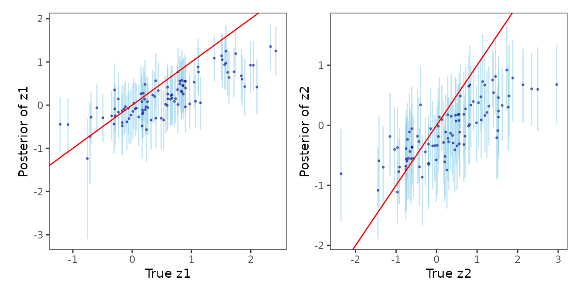

# Spatial-Temporal Regression Models

In this article, we discuss the following functions -

- [`stvcGLMexact()`](https://span-18.github.io/spStack-dev/reference/stvcGLMexact.md)
- [`stvcGLMstack()`](https://span-18.github.io/spStack-dev/reference/stvcGLMstack.md)
- [`recoverGLMscale()`](https://span-18.github.io/spStack-dev/reference/recoverGLMscale.md)

These functions can be used to fit non-Gaussian spatial-temporal
point-referenced data.

``` r
library(patchwork)
set.seed(1729)
```

## Bayesian non-Gaussian spatially-temporally varying coefficient models

We illustrate the spatially-temporally varying coefficient model using
the synthetic spatial-temporal Poisson count data.

We first load the data `sim_stvcPoisson` which consists of data at 500
spatial-temporal locations. We use the first 100 locations for the
following analysis.

``` r
library(spStack)
data("sim_stvcPoisson")
n_train <- 100
dat <- sim_stvcPoisson[1:n_train, ]
```

The dataset consists of one covariate `x1`, response variable `y`,
spatial locations given by `s1` and `s2`, a temporal coordinate
`t_coords`, and the true spatially-temporally varying coefficients
`z1_true` and `z2_true` associated with an intercept and `x1`,
respectively. We elaborate below.

``` r
head(dat)
```

    ##          s1         s2   t_coords           x1  y    z1_true     z2_true
    ## 1 0.8458822 0.43458448 0.51451148 -0.766742372 25  2.0451334  1.28806986
    ## 2 0.7965761 0.20391526 0.47538393  0.128523505 12  0.3791130  0.06896414
    ## 3 0.9182483 0.07049103 0.85633367  1.669250054 12  0.3188769  0.58753365
    ## 4 0.8099342 0.99920483 0.51844637  0.988857940 12  1.8994169 -0.66931170
    ## 5 0.7379233 0.70276900 0.54693172  1.233493103 28  0.9009137  0.90728556
    ## 6 0.4131629 0.08673831 0.04680728  0.004780498  5 -0.6926862 -0.61172092

### Formula for varying coefficients model

We define the spatially-temporally varying coefficients model using a
`formula`, similar to that in the widely used
[`lm()`](https://rdrr.io/r/stats/lm.html) function in the `stats`
package. Suppose $\ell = (s,t)$ refers to a space-time ccoordinate. See
“Technical Overview for more details”. Then, given `family = "poisson"`,
the formula `y ~ x1 + (x1)` corresponds to the spatial-temporal
generalized linear model
$$y\left( \ell \right) \sim {\mathsf{P}\mathsf{o}\mathsf{i}\mathsf{s}\mathsf{s}\mathsf{o}\mathsf{n}}\left( \lambda\left( \ell \right) \right),\quad\log\lambda\left( \ell \right) = \beta_{0} + \beta_{1}x_{1}\left( \ell \right) + z_{1}\left( \ell \right) + x_{1}\left( \ell \right)z_{2}\left( \ell \right)\;,$$
where the `y` corresponds to the response variable
$y\left( \ell \right)$, which is regressed on the predictor `x1` given
by $x_{1}\left( \ell \right)$. The model variables specified outside the
parentheses corresponds to predictors with fixed effects, and the model
inside the parentheses correspond to variables with spatial-temporal
varying coefficient. The intercept is automatically considered within
both the fixed and varying coefficient components of the model, and
hence `y ~ x1 + (x1)` is functionally equivalent to
`y ~ 1 + x1 + (1 + x1)`. The spatially-temporally varying coefficients
$z\left( \ell \right) = \left( z_{1}\left( \ell \right),z_{2}\left( \ell \right) \right)^{\top}$
is multivariate Gaussian process, and we pursue the following
specifications for $z\left( \ell \right)$ - independent process,
independent process with shared parameters, and a multivariate process.
For now, we only support the `cor.fn="gneiting-decay"` covariogram. See
“Technical Overview” for more details.

To implement a model, with just a spatial-temporal random effect, one
may specify the formula `y ~ x1 + (1)` which corresponds to the model
$$y\left( \ell \right) \sim {\mathsf{P}\mathsf{o}\mathsf{i}\mathsf{s}\mathsf{s}\mathsf{o}\mathsf{n}}\left( \lambda\left( \ell \right) \right),\quad\log\lambda\left( \ell \right) = \beta_{0} + \beta_{1}x_{1}\left( \ell \right) + z_{1}\left( \ell \right)\;.$$

### Using fixed hyperparameters

We use the function
[`stvcGLMexact()`](https://span-18.github.io/spStack-dev/reference/stvcGLMexact.md)
to fit spatially-temporally varying coefficient generalized linear
models. In the following code snippets, we demonstrate the uasge of the
argument `process.Type` to implement different variations of
spatial-temporal process specifications for the varying coefficients.

#### Independent processes

In this case, since there are two independent processes
$z_{1}\left( \ell \right)$ and $z_{2}\left( \ell \right)$ the candidate
values of the spatial-temporal process parameters `sptParams` is a list
with tags `phi_s` and `phi_t`, with each tag being of length 2. Here,
the scale parameter
$\sigma = \left( \sigma_{z1}^{2},\sigma_{z2}^{2} \right)^{\top}$ has
dimension 2.

``` r
mod1 <- stvcGLMexact(y ~ x1 + (x1), data = dat, family = "poisson",
                     sp_coords = as.matrix(dat[, c("s1", "s2")]),
                     time_coords = as.matrix(dat[, "t_coords"]),
                     cor.fn = "gneiting-decay",
                     process.type = "independent",
                     priors = list(nu.beta = 5, nu.z = 5),
                     sptParams = list(phi_s = c(1, 2), phi_t = c(1, 2)),
                     verbose = FALSE, n.samples = 500)
```

    ## Some priors were not supplied. Using defaults.

Posterior samples of the scale parameters can be recovered by running
[`recoverGLMscale()`](https://span-18.github.io/spStack-dev/reference/recoverGLMscale.md)
on `mod1`.

``` r
mod1 <- recoverGLMscale(mod1)
```

We visualize the posterior distributions of the scale parameters as
follows.

``` r
post_scale_df <- data.frame(value = sqrt(c(mod1$samples$z.scale[1, ], mod1$samples$z.scale[2, ])),
                            group = factor(rep(c("sigma.z1", "sigma.z2"),
                                    each = length(mod1$samples$z.scale[1, ]))))
library(ggplot2)
ggplot(post_scale_df, aes(x = value)) +
  geom_density(fill = "lightblue", alpha = 0.6) +
  facet_wrap(~ group, scales = "free") + labs(x = "", y = "Density") +
  theme_bw() + theme(panel.background = element_blank(),
                     panel.grid = element_blank(), aspect.ratio = 1)
```


#### Independent shared processes

In this case, the processes $z_{1}\left( \ell \right)$ and
$z_{2}\left( \ell \right)$ are independent but share a common covariance
matrix. Hence, `sptParams` is a list with tags `phi_s` and `phi_t`, with
each tag being of length 1. Here, the scale parameter
$\sigma = \sigma_{z}^{2}$ is 1-dimensional.

``` r
mod2 <- stvcGLMexact(y ~ x1 + (x1), data = dat, family = "poisson",
                     sp_coords = as.matrix(dat[, c("s1", "s2")]),
                     time_coords = as.matrix(dat[, "t_coords"]),
                     cor.fn = "gneiting-decay",
                     process.type = "independent.shared",
                     priors = list(nu.beta = 5, nu.z = 5),
                     sptParams = list(phi_s = 1, phi_t = 1),
                     verbose = FALSE, n.samples = 500)
```

    ## Some priors were not supplied. Using defaults.

Posterior samples of the scale parameters can be recovered by running
[`recoverGLMscale()`](https://span-18.github.io/spStack-dev/reference/recoverGLMscale.md)
on `mod2`.

``` r
mod2 <- recoverGLMscale(mod2)
```

We visualize the posterior distributions of the scale parameters as
follows.

``` r
post_scale_df <- data.frame(value = sqrt(mod2$samples$z.scale),
                            group = factor(rep(c("sigma.z"),
                                               each = length(mod2$samples$z.scale))))
ggplot(post_scale_df, aes(x = value)) +
  geom_density(fill = "lightblue", alpha = 0.6) +
  facet_wrap(~ group, scales = "free") + labs(x = "", y = "Density") +
  theme_bw() + theme(panel.background = element_blank(),
                     panel.grid = element_blank(), aspect.ratio = 1)
```


#### Multivariate processes

In this case,
$z\left( \ell \right) = \left( z_{1}\left( \ell \right),z_{2}\left( \ell \right) \right)^{\top}$
is a 2-dimensional Gaussian process with covariance matrix $\Sigma$.
Further, we put an inverse-Wishart prior on $\Sigma$, which can be
specified through the `priors` argument. If not supplied, uses the
default ${IW}\left( \nu_{z} + 2r,I_{r} \right)$, where $r = 2$ is the
dimension of the multivariate process. Here, `sptParams` is a list with
tags `phi_s` and `phi_t`, with each tag being of length 1, and the scale
parameter $\sigma = \Sigma$ is an $2 \times 2$ matrix.

``` r
mod3 <- stvcGLMexact(y ~ x1 + (x1), data = dat, family = "poisson",
                     sp_coords = as.matrix(dat[, c("s1", "s2")]),
                     time_coords = as.matrix(dat[, "t_coords"]),
                     cor.fn = "gneiting-decay",
                     process.type = "multivariate",
                     priors = list(nu.beta = 5, nu.z = 5),
                     sptParams = list(phi_s = 1, phi_t = 1),
                     verbose = FALSE, n.samples = 500)
```

    ## Some priors were not supplied. Using defaults.

Posterior samples of the scale parameters can be recovered by running
[`recoverGLMscale()`](https://span-18.github.io/spStack-dev/reference/recoverGLMscale.md)
on `mod3`.

``` r
mod3 <- recoverGLMscale(mod3)
```

We visualize the posterior distribution of the scale matrix $\Sigma$ as
follows.

``` r
post_scale_z <- mod3$samples$z.scale

r <- sqrt(dim(post_scale_z)[1])
# Function to get (i,j) index from row number (column-major)
get_indices <- function(k, r) {
  j <- ((k - 1) %/% r) + 1
  i <- ((k - 1) %% r) + 1
  c(i, j)
}

# Generate plots into a matrix
plot_matrix <- matrix(vector("list", r * r), nrow = r, ncol = r)
for (k in 1:(r^2)) {
  ij <- get_indices(k, r)
  i <- ij[1]
  j <- ij[2]

  if (i >= j) {
    df <- data.frame(value = post_scale_z[k, ])
    p <- ggplot(df, aes(x = value)) +
      geom_density(fill = "lightblue", alpha = 0.7) +
      theme_bw(base_size = 9) +
      labs(title = bquote(Sigma[.(i) * .(j)])) +
      theme(axis.title = element_blank(), axis.text = element_text(size = 6),
        plot.title = element_text(size = 9, hjust = 0.5),
        panel.grid = element_blank(), aspect.ratio = 1)
  } else {
    p <- ggplot() + theme_void()
  }

  plot_matrix[j, i] <- list(p)
}

library(patchwork)
# Assemble with patchwork
final_plot <- wrap_plots(plot_matrix, nrow = r)
final_plot
```


Posterior distributions of elements of the scale matrix.

### Using predictive stacking

For implementing predictive stacking for spatially-temporally varying
models, we offer a helper function
[`candidateModels()`](https://span-18.github.io/spStack-dev/reference/candidateModels.md)
to create a collection of candidate models. The grid of candidate values
can be combined either using a Cartesian product or a simple
element-by-element combination. We demonstrate stacking based on the
multivariate spatial-temporal process model.

**Step 1.** Create candidate models.

``` r
mod.list <- candidateModels(list(
  phi_s = list(1, 2, 3),
  phi_t = list(1, 2, 4),
  boundary = c(0.5, 0.75)), "cartesian")
```

**Step 2.** Run
[`stvcGLMstack()`](https://span-18.github.io/spStack-dev/reference/stvcGLMstack.md).

``` r
mod1 <- stvcGLMstack(y ~ x1 + (x1), data = dat, family = "poisson",
                     sp_coords = as.matrix(dat[, c("s1", "s2")]),
                     time_coords = as.matrix(dat[, "t_coords"]),
                     cor.fn = "gneiting-decay",
                     process.type = "multivariate",
                     priors = list(nu.beta = 5, nu.z = 5),
                     candidate.models = mod.list,
                     loopd.controls = list(method = "CV", CV.K = 10, nMC = 500),
                     n.samples = 1000)
```

    ## Some priors were not supplied. Using defaults.

    ## --------------------------------------------------

    ## Solver diagnostics:

    ## Installed solvers: CLARABEL, SCS, OSQP, HIGHS

    ## Requested solver: DEFAULT (CLARABEL -> ECOS -> SCS)

    ## Solver search order: CLARABEL -> SCS

    ## --------------------------------------------------

    ## ────────────────────────────────── CVXR v1.8.1 ─────────────────────────────────

    ## ℹ Problem: 1 variable, 2 constraints (DCP)

    ## ℹ Compilation: "CLARABEL" via CVXR::FlipObjective -> CVXR::Dcp2Cone -> CVXR::CvxAttr2Constr -> CVXR::ConeMatrixStuffing -> CVXR::Clarabel_Solver

    ## ℹ Compile time: 0.737s

    ## ─────────────────────────────── Numerical solver ───────────────────────────────

    ## ──────────────────────────────────── Summary ───────────────────────────────────

    ## ✔ Status: optimal

    ## ✔ Optimal value: -264.899

    ## ℹ Compile time: 0.737s

    ## ℹ Solver time: 0.046s

    ## 
    ## STACKING WEIGHTS:
    ## 
    ##            | phi_s | phi_t | boundary | weight |
    ## +----------+-------+-------+----------+--------+
    ## | Model 1  |      1|      1|      0.50| 0.000  |
    ## | Model 2  |      2|      1|      0.50| 0.000  |
    ## | Model 3  |      3|      1|      0.50| 0.091  |
    ## | Model 4  |      1|      2|      0.50| 0.000  |
    ## | Model 5  |      2|      2|      0.50| 0.000  |
    ## | Model 6  |      3|      2|      0.50| 0.000  |
    ## | Model 7  |      1|      4|      0.50| 0.000  |
    ## | Model 8  |      2|      4|      0.50| 0.000  |
    ## | Model 9  |      3|      4|      0.50| 0.411  |
    ## | Model 10 |      1|      1|      0.75| 0.000  |
    ## | Model 11 |      2|      1|      0.75| 0.000  |
    ## | Model 12 |      3|      1|      0.75| 0.000  |
    ## | Model 13 |      1|      2|      0.75| 0.000  |
    ## | Model 14 |      2|      2|      0.75| 0.000  |
    ## | Model 15 |      3|      2|      0.75| 0.255  |
    ## | Model 16 |      1|      4|      0.75| 0.000  |
    ## | Model 17 |      2|      4|      0.75| 0.213  |
    ## | Model 18 |      3|      4|      0.75| 0.031  |
    ## +----------+-------+-------+----------+--------+

**Step 3.** Recover posterior samples of the scale parameters.

``` r
mod1 <- recoverGLMscale(mod1)
```

**Step 4.** Sample from the stacked posterior distribution.

``` r
post_samps <- stackedSampler(mod1)
```

Now, we analyze the posterior distribution of the latent process as
obtained from the stacked posterior.

``` r
post_z <- post_samps$z

post_z1_summ <- t(apply(post_z[1:n_train,], 1,
                        function(x) quantile(x, c(0.025, 0.5, 0.975))))
post_z2_summ <- t(apply(post_z[n_train + 1:n_train,], 1,
                        function(x) quantile(x, c(0.025, 0.5, 0.975))))

z1_combn <- data.frame(z = dat$z1_true, zL = post_z1_summ[, 1],
                       zM = post_z1_summ[, 2], zU = post_z1_summ[, 3])
z2_combn <- data.frame(z = dat$z2_true, zL = post_z2_summ[, 1],
                       zM = post_z2_summ[, 2], zU = post_z2_summ[, 3])

plot_z1_summ <- ggplot(data = z1_combn, aes(x = z)) +
  geom_errorbar(aes(ymin = zL, ymax = zU), alpha = 0.5, color = "skyblue") +
  geom_point(aes(y = zM), size = 0.5, color = "darkblue", alpha = 0.5) +
  geom_abline(slope = 1, intercept = 0, color = "red", linetype = "solid") +
  xlab("True z1") + ylab("Posterior of z1") + theme_bw() +
  theme(panel.grid = element_blank(), aspect.ratio = 1)

plot_z2_summ <- ggplot(data = z2_combn, aes(x = z)) +
  geom_errorbar(aes(ymin = zL, ymax = zU), alpha = 0.5, color = "skyblue") +
  geom_point(aes(y = zM), size = 0.5, color = "darkblue", alpha = 0.5) +
  geom_abline(slope = 1, intercept = 0, color = "red", linetype = "solid") +
  xlab("True z2") + ylab("Posterior of z2") + theme_bw() +
  theme(panel.grid = element_blank(), aspect.ratio = 1)

plot_z1_summ + plot_z2_summ
```



Next, we analyze the posterior distribution of the scale matrix that
models the inter-process dependence structure.

``` r
post_scale_z <- post_samps$z.scale
r <- sqrt(dim(post_scale_z)[1])
# Generate plots into a matrix
plot_matrix <- matrix(vector("list", r * r), nrow = r, ncol = r)
for (k in 1:(r^2)) {
  ij <- get_indices(k, r)
  i <- ij[1]
  j <- ij[2]

  if (i >= j) {
    df <- data.frame(value = post_scale_z[k, ])
    p <- ggplot(df, aes(x = value)) +
      geom_density(fill = "lightblue", alpha = 0.7) +
      theme_bw(base_size = 9) +
      labs(title = bquote(Sigma[.(i) * .(j)])) +
      theme(axis.title = element_blank(), axis.text = element_text(size = 6),
        plot.title = element_text(size = 9, hjust = 0.5),
        panel.grid = element_blank(), aspect.ratio = 1)
  } else {
    p <- ggplot() + theme_void()
  }

  plot_matrix[j, i] <- list(p)
}

# Assemble with patchwork
final_plot <- wrap_plots(plot_matrix, nrow = r)
final_plot
```


Stacked posterior distribution of the elements of the inter-process
covariance matrix.
