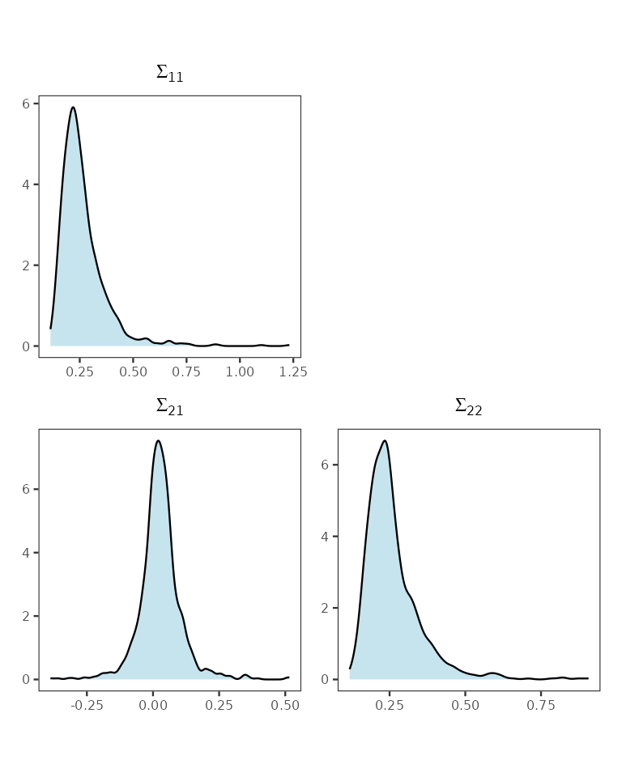

# Spatial-Temporal Regression Models

In this article, we discuss the following functions -

- [`stvcLMexact()`](https://span-18.github.io/spStack-dev/reference/stvcLMexact.md)
- [`stvcLMstack()`](https://span-18.github.io/spStack-dev/reference/stvcLMstack.md)
- [`stvcGLMexact()`](https://span-18.github.io/spStack-dev/reference/stvcGLMexact.md)
- [`stvcGLMstack()`](https://span-18.github.io/spStack-dev/reference/stvcGLMstack.md)
- [`recoverGLMscale()`](https://span-18.github.io/spStack-dev/reference/recoverGLMscale.md)

These functions can be used to fit Gaussian and non-Gaussian
spatial-temporal point-referenced data with spatially-temporally varying
coefficients.

``` r

library(patchwork)
set.seed(1729)
```

## Data

The package lazy-loads the synthetic dataset `simSpaceTime`, observed at
500 space-time coordinates $`\ell = (s, t)`$ with $`s`$ in the unit
square and $`t`$ in the unit interval. It has two covariates `x1` and
`x2`, a varying intercept `z1_true` that is a wave travelling across
space over time, $`z_1(\ell) = \sin\{2\pi(s_1 - t)\}`$, and a varying
slope of `x1`, `z2_true`, $`z_2(\ell) = \cos(2\pi s_2) \cos(\pi t)`$.
The Gaussian response `y_gauss` and the Poisson response `y_pois` share
them. Both surfaces are deterministic, not draws from Gaussian
processes. See
[`?simSpaceTime`](https://span-18.github.io/spStack-dev/reference/simSpaceTime.md)
for the code that generated the data. We use the first 200 space-time
coordinates for the following analysis.

``` r

library(spStack)
data("simSpaceTime")
n_train <- 200
dat <- simSpaceTime[1:n_train, ]
head(dat)
```

    ##          s1        s2  t_coords          x1         x2    y_gauss y_pois
    ## 1 0.2216173 0.9919157 0.8458822 -0.16471416  2.0451334  0.6247576     28
    ## 2 0.5937945 0.3285576 0.7965761 -1.47214370 -1.1420950 -6.0580521      3
    ## 3 0.5511327 0.1808101 0.9182483  0.53238120 -0.1035955  4.0516817      0
    ## 4 0.2295121 0.7660980 0.8099342  1.64998720  1.3164616  8.8155560      7
    ## 5 0.9524661 0.9817298 0.7379233 -0.03672285 -0.9846361  4.1997422     16
    ## 6 0.6469231 0.4993637 0.4131629 -0.34204648 -1.0552852  2.0616680     19
    ##      z1_true     z2_true
    ## 1  0.7038331 -0.88391758
    ## 2 -0.9563118  0.38028823
    ## 3 -0.7412544 -0.40735390
    ## 4  0.4840762 -0.08350197
    ## 5  0.9752861 -0.67530256
    ## 6  0.9947987 -0.26943332

### Formula for varying coefficients model

We define the spatially-temporally varying coefficients model using a
`formula`, similar to that in the widely used
[`lm()`](https://rdrr.io/r/stats/lm.html) function in the `stats`
package. Suppose $`\ell = (s, t)`$ refers to a space-time coordinate.
See “Technical Overview” for more details. The formula
`y_gauss ~ x1 + x2 + (x1)` corresponds to the spatial-temporal linear
model
``` math
y(\ell) = \beta_0 + \beta_1 x_1(\ell) + \beta_2 x_2(\ell) + z_1(\ell) + x_1(\ell) z_2(\ell) + \epsilon(\ell)\;,
```
where `y_gauss` corresponds to the response variable $`y(\ell)`$, which
is regressed on the predictors `x1` and `x2` given by $`x_1(\ell)`$ and
$`x_2(\ell)`$. The model variables specified outside the parentheses
correspond to predictors with fixed effects, and the model inside the
parentheses correspond to variables with spatial-temporal varying
coefficients. The intercept is automatically considered within both the
fixed and varying coefficient components of the model, and hence
`y_gauss ~ x1 + x2 + (x1)` is functionally equivalent to
`y_gauss ~ 1 + x1 + x2 + (1 + x1)`. For now, we only support the
`cor.fn="gneiting-decay"` covariogram. To implement a model with just a
spatial-temporal random effect, one may specify the formula
`y_gauss ~ x1 + x2 + (1)`.

## Bayesian Gaussian spatially-temporally varying coefficient models

For a Gaussian response, the model is
``` math
y(\ell) = x(\ell)^{ \scriptstyle \top }\beta + \tilde{x}(\ell)^{ \scriptstyle \top }z(\ell) + \epsilon(\ell), \quad \epsilon(\ell) \sim \mathrm{N}(0, \sigma^2),
```
where each of the $`r`$ varying coefficients $`z_j`$ is an independent
Gaussian process with variance $`\sigma^2_{z_j} = \sigma^2/\delta^2_j`$
and a Gneiting correlation function with decay parameters $`\phi_{s,j}`$
and $`\phi_{t,j}`$. Given these and the noise-to-spatial variance ratios
$`\delta^2_j`$, the joint posterior distribution is available in closed
form and
[`stvcLMexact()`](https://span-18.github.io/spStack-dev/reference/stvcLMexact.md)
samples from it exactly. With `process.type = "independent"`, each
process has its own $`(\phi_s, \phi_t, \delta^2)`$, supplied as vectors
of length $`r`$; with `process.type = "independent.shared"`, the
processes share one.

``` r

mod_lm <- stvcLMexact(y_gauss ~ x1 + x2 + (x1), data = dat,
                      sp_coords = as.matrix(dat[, c("s1", "s2")]),
                      time_coords = as.matrix(dat[, "t_coords"]),
                      cor.fn = "gneiting-decay",
                      process.type = "independent",
                      sptParams = list(phi_s = c(3, 6), phi_t = c(4, 2)),
                      noise_sp_ratio = c(0.5, 1),
                      n.samples = 1000, loopd = TRUE, verbose = TRUE)
```

    ## ----------------------------------------
    ##  Model description
    ## ----------------------------------------
    ## Model fit with 200 observations.
    ## 
    ## Number of covariates 3 (including intercept).
    ## Number of covariates with spatial-temporally varying coefficients 2.
    ## 
    ## Using the gneiting-decay spatial-temporal correlation function.
    ## Process type: independent.
    ## 
    ## Priors:
    ##  beta flat.
    ##  sigma.sq: flat, proportional to 1/sigma.sq.
    ## 
    ## Spatial-temporal process parameters:
    ##  process 1: phi_s = 3.00, phi_t = 4.00, noise-to-spatial variance ratio = 0.50.
    ##  process 2: phi_s = 6.00, phi_t = 2.00, noise-to-spatial variance ratio = 1.00.
    ## 
    ## Number of posterior samples = 1000.
    ## 
    ## LOO-PD calculation method = exact.
    ## ----------------------------------------

The fixed effects are summarized below; `y_gauss` was simulated with
$`\beta = (2, 5, -1)^{ \scriptstyle \top }`$. The samples of the process
variances are returned as `sigmaSq.z`.

``` r

summary_beta <- t(apply(mod_lm$samples$beta, 1, function(x) quantile(x, c(0.025, 0.5, 0.975))))
rownames(summary_beta) <- mod_lm$X.names
print(summary_beta)
```

    ##                  2.5%        50%      97.5%
    ## (Intercept)  1.175300  1.8631698  2.5378232
    ## x1           4.591073  4.9749871  5.3475258
    ## x2          -1.032438 -0.9194189 -0.8102856

Next, we stack candidate models built from candidate values of the
process parameters and noise-to-spatial variance ratios. For
`process.type = "independent"`, the candidate values are vectors of
length $`r`$, supplied as [`list()`](https://rdrr.io/r/base/list.html)
entries in
[`candidateModels()`](https://span-18.github.io/spStack-dev/reference/candidateModels.md).

``` r

mod.list.lm <- candidateModels(list(phi_s = list(c(3, 6), c(2, 4)),
                                    phi_t = list(c(4, 2), c(1, 1)),
                                    noise_sp_ratio = list(c(0.5, 1), c(1, 2))),
                               "cartesian")

mod_lm_stack <- stvcLMstack(y_gauss ~ x1 + x2 + (x1), data = dat,
                            sp_coords = as.matrix(dat[, c("s1", "s2")]),
                            time_coords = as.matrix(dat[, "t_coords"]),
                            cor.fn = "gneiting-decay",
                            process.type = "independent",
                            candidate.models = mod.list.lm,
                            n.samples = 1000, verbose = TRUE)
```

    ## 
    ## STACKING WEIGHTS:
    ## 
    ##           | phi_s[1] | phi_s[2] | phi_t[1] | phi_t[2] | noise_sp_ratio[1] | noise_sp_ratio[2] | weight |
    ## +---------+----------+----------+----------+----------+-------------------+-------------------+--------+
    ## | Model 1 |         3|         6|         4|         2|                0.5|                  1| 0      |
    ## | Model 2 |         2|         4|         4|         2|                0.5|                  1| 1      |
    ## | Model 3 |         3|         6|         1|         1|                0.5|                  1| 0      |
    ## | Model 4 |         2|         4|         1|         1|                0.5|                  1| 0      |
    ## | Model 5 |         3|         6|         4|         2|                1.0|                  2| 0      |
    ## | Model 6 |         2|         4|         4|         2|                1.0|                  2| 0      |
    ## | Model 7 |         3|         6|         1|         1|                1.0|                  2| 0      |
    ## | Model 8 |         2|         4|         1|         1|                1.0|                  2| 0      |
    ## +---------+----------+----------+----------+----------+-------------------+-------------------+--------+

``` r

post_lm <- stackedSampler(mod_lm_stack)
```

The samples of $`z`$ are stacked by process: rows $`1, \ldots, n`$ hold
$`z_1`$ and rows $`n+1, \ldots, 2n`$ hold $`z_2`$. We compare their
stacked posteriors with the true values.

``` r

post_z1_summ <- t(apply(post_lm$z[1:n_train, ], 1,
                        function(x) quantile(x, c(0.025, 0.5, 0.975))))
post_z2_summ <- t(apply(post_lm$z[n_train + 1:n_train, ], 1,
                        function(x) quantile(x, c(0.025, 0.5, 0.975))))

z1_combn <- data.frame(z = dat$z1_true, zL = post_z1_summ[, 1],
                       zM = post_z1_summ[, 2], zU = post_z1_summ[, 3])
z2_combn <- data.frame(z = dat$z2_true, zL = post_z2_summ[, 1],
                       zM = post_z2_summ[, 2], zU = post_z2_summ[, 3])

library(ggplot2)
plot_z1_summ <- ggplot(data = z1_combn, aes(x = z)) +
  geom_errorbar(aes(ymin = zL, ymax = zU), alpha = 0.5, color = "skyblue") +
  geom_point(aes(y = zM), size = 0.5, color = "darkblue", alpha = 0.5) +
  geom_abline(slope = 1, intercept = 0, color = "red", linetype = "solid") +
  xlab("True z1") + ylab("Stacked posterior of z1") + theme_bw() +
  theme(panel.grid = element_blank(), aspect.ratio = 1)

plot_z2_summ <- ggplot(data = z2_combn, aes(x = z)) +
  geom_errorbar(aes(ymin = zL, ymax = zU), alpha = 0.5, color = "skyblue") +
  geom_point(aes(y = zM), size = 0.5, color = "darkblue", alpha = 0.5) +
  geom_abline(slope = 1, intercept = 0, color = "red", linetype = "solid") +
  xlab("True z2") + ylab("Stacked posterior of z2") + theme_bw() +
  theme(panel.grid = element_blank(), aspect.ratio = 1)

plot_z1_summ + plot_z2_summ
```


## Bayesian non-Gaussian spatially-temporally varying coefficient models

We now analyze the Poisson counts `y_pois`. Given `family = "poisson"`,
the formula `y_pois ~ x1 + x2 + (x1)` corresponds to the
spatial-temporal generalized linear model
``` math
y(\ell) \sim \mathsf{Poisson}(\lambda(\ell)), \quad \log \lambda(\ell) = \beta_0 + \beta_1 x_1(\ell) + \beta_2 x_2(\ell) + z_1(\ell) + x_1(\ell) z_2(\ell)\;.
```
The spatially-temporally varying coefficients
$`z(\ell) = (z_1(\ell), z_2(\ell))^{{ \scriptstyle \top }}`$ is a
multivariate Gaussian process, and we pursue the following
specifications for $`z(\ell)`$ - independent process, independent
process with shared parameters, and a multivariate process. See
“Technical Overview” for more details.

### Using fixed hyperparameters

We use the function
[`stvcGLMexact()`](https://span-18.github.io/spStack-dev/reference/stvcGLMexact.md)
to fit spatially-temporally varying coefficient generalized linear
models. In the following code snippets, we demonstrate the uasge of the
argument `process.Type` to implement different variations of
spatial-temporal process specifications for the varying coefficients.

#### Independent processes

In this case, since there are two independent processes $`z_1(\ell)`$
and $`z_2(\ell)`$ the candidate values of the spatial-temporal process
parameters `sptParams` is a list with tags `phi_s` and `phi_t`, with
each tag being of length 2. Here, the scale parameter
$`\sigma = (\sigma^2_{z1}, \sigma^2_{z2})^{{ \scriptstyle \top }}`$ has
dimension 2.

``` r

mod1 <- stvcGLMexact(y_pois ~ x1 + x2 + (x1), data = dat, family = "poisson",
                     sp_coords = as.matrix(dat[, c("s1", "s2")]),
                     time_coords = as.matrix(dat[, "t_coords"]),
                     cor.fn = "gneiting-decay",
                     process.type = "independent",
                     priors = list(nu.beta = 5, nu.z = 5),
                     sptParams = list(phi_s = c(3, 6), phi_t = c(4, 2)),
                     verbose = FALSE, n.samples = 500)
```

    ## Some priors were not supplied. Using defaults.

Posterior samples of the scale parameters can be recovered by running
[`recoverGLMscale()`](https://span-18.github.io/spStack-dev/reference/recoverGLMscale.md)
on `mod1`.

``` r

mod1 <- recoverGLMscale(mod1)
```

We visualize the posterior distributions of the scale parameters as
follows.

``` r

post_scale_df <- data.frame(value = sqrt(c(mod1$samples$z.scale[1, ], mod1$samples$z.scale[2, ])),
                            group = factor(rep(c("sigma.z1", "sigma.z2"),
                                    each = length(mod1$samples$z.scale[1, ]))))
library(ggplot2)
ggplot(post_scale_df, aes(x = value)) +
  geom_density(fill = "lightblue", alpha = 0.6) +
  facet_wrap(~ group, scales = "free") + labs(x = "", y = "Density") +
  theme_bw() + theme(panel.background = element_blank(),
                     panel.grid = element_blank(), aspect.ratio = 1)
```


#### Independent shared processes

In this case, the processes $`z_1(\ell)`$ and $`z_2(\ell)`$ are
independent but share a common covariance matrix. Hence, `sptParams` is
a list with tags `phi_s` and `phi_t`, with each tag being of length 1.
Here, the scale parameter $`\sigma = \sigma_z^2`$ is 1-dimensional.

``` r

mod2 <- stvcGLMexact(y_pois ~ x1 + x2 + (x1), data = dat, family = "poisson",
                     sp_coords = as.matrix(dat[, c("s1", "s2")]),
                     time_coords = as.matrix(dat[, "t_coords"]),
                     cor.fn = "gneiting-decay",
                     process.type = "independent.shared",
                     priors = list(nu.beta = 5, nu.z = 5),
                     sptParams = list(phi_s = 4, phi_t = 4),
                     verbose = FALSE, n.samples = 500)
```

    ## Some priors were not supplied. Using defaults.

Posterior samples of the scale parameters can be recovered by running
[`recoverGLMscale()`](https://span-18.github.io/spStack-dev/reference/recoverGLMscale.md)
on `mod2`.

``` r

mod2 <- recoverGLMscale(mod2)
```

We visualize the posterior distributions of the scale parameters as
follows.

``` r

post_scale_df <- data.frame(value = sqrt(mod2$samples$z.scale),
                            group = factor(rep(c("sigma.z"),
                                               each = length(mod2$samples$z.scale))))
ggplot(post_scale_df, aes(x = value)) +
  geom_density(fill = "lightblue", alpha = 0.6) +
  facet_wrap(~ group, scales = "free") + labs(x = "", y = "Density") +
  theme_bw() + theme(panel.background = element_blank(),
                     panel.grid = element_blank(), aspect.ratio = 1)
```


#### Multivariate processes

In this case,
$`z(\ell) = (z_1(\ell), z_2(\ell))^{{ \scriptstyle \top }}`$ is a
2-dimensional Gaussian process with covariance matrix $`\Sigma`$.
Further, we put an inverse-Wishart prior on $`\Sigma`$, which can be
specified through the `priors` argument. If not supplied, uses the
default $`\mathrm{IW}(\nu_z + 2r, I_r)`$, where $`r = 2`$ is the
dimension of the multivariate process. Here, `sptParams` is a list with
tags `phi_s` and `phi_t`, with each tag being of length 1, and the scale
parameter $`\sigma = \Sigma`$ is an $`2 \times 2`$ matrix.

``` r

mod3 <- stvcGLMexact(y_pois ~ x1 + x2 + (x1), data = dat, family = "poisson",
                     sp_coords = as.matrix(dat[, c("s1", "s2")]),
                     time_coords = as.matrix(dat[, "t_coords"]),
                     cor.fn = "gneiting-decay",
                     process.type = "multivariate",
                     priors = list(nu.beta = 5, nu.z = 5),
                     sptParams = list(phi_s = 4, phi_t = 4),
                     verbose = FALSE, n.samples = 500)
```

    ## Some priors were not supplied. Using defaults.

Posterior samples of the scale parameters can be recovered by running
[`recoverGLMscale()`](https://span-18.github.io/spStack-dev/reference/recoverGLMscale.md)
on `mod3`.

``` r

mod3 <- recoverGLMscale(mod3)
```

We visualize the posterior distribution of the scale matrix $`\Sigma`$
as follows.

``` r

post_scale_z <- mod3$samples$z.scale

r <- sqrt(dim(post_scale_z)[1])
# Function to get (i,j) index from row number (column-major)
get_indices <- function(k, r) {
  j <- ((k - 1) %/% r) + 1
  i <- ((k - 1) %% r) + 1
  c(i, j)
}

# Generate plots into a matrix
plot_matrix <- matrix(vector("list", r * r), nrow = r, ncol = r)
for (k in 1:(r^2)) {
  ij <- get_indices(k, r)
  i <- ij[1]
  j <- ij[2]

  if (i >= j) {
    df <- data.frame(value = post_scale_z[k, ])
    p <- ggplot(df, aes(x = value)) +
      geom_density(fill = "lightblue", alpha = 0.7) +
      theme_bw(base_size = 9) +
      labs(title = bquote(Sigma[.(i) * .(j)])) +
      theme(axis.title = element_blank(), axis.text = element_text(size = 6),
        plot.title = element_text(size = 9, hjust = 0.5),
        panel.grid = element_blank(), aspect.ratio = 1)
  } else {
    p <- ggplot() + theme_void()
  }

  plot_matrix[j, i] <- list(p)
}

library(patchwork)
# Assemble with patchwork
final_plot <- wrap_plots(plot_matrix, nrow = r)
final_plot
```


Posterior distributions of elements of the scale matrix.

### Using predictive stacking

For implementing predictive stacking for spatially-temporally varying
models, we offer a helper function
[`candidateModels()`](https://span-18.github.io/spStack-dev/reference/candidateModels.md)
to create a collection of candidate models. The grid of candidate values
can be combined either using a Cartesian product or a simple
element-by-element combination. We demonstrate stacking based on the
multivariate spatial-temporal process model.

**Step 1.** Create candidate models.

``` r

mod.list <- candidateModels(list(
  phi_s = list(2, 4),
  phi_t = list(1, 4),
  boundary = c(0.5, 0.75)), "cartesian")
```

**Step 2.** Run
[`stvcGLMstack()`](https://span-18.github.io/spStack-dev/reference/stvcGLMstack.md).

``` r

mod1 <- stvcGLMstack(y_pois ~ x1 + x2 + (x1), data = dat, family = "poisson",
                     sp_coords = as.matrix(dat[, c("s1", "s2")]),
                     time_coords = as.matrix(dat[, "t_coords"]),
                     cor.fn = "gneiting-decay",
                     process.type = "multivariate",
                     priors = list(nu.beta = 5, nu.z = 5),
                     candidate.models = mod.list,
                     loopd.controls = list(method = "CV", CV.K = 10, nMC = 500),
                     n.samples = 1000)
```

    ## Some priors were not supplied. Using defaults.

    ## 
    ## STACKING WEIGHTS:
    ## 
    ##           | phi_s | phi_t | boundary | weight |
    ## +---------+-------+-------+----------+--------+
    ## | Model 1 |      2|      1|      0.50| 0.000  |
    ## | Model 2 |      4|      1|      0.50| 0.000  |
    ## | Model 3 |      2|      4|      0.50| 0.117  |
    ## | Model 4 |      4|      4|      0.50| 0.308  |
    ## | Model 5 |      2|      1|      0.75| 0.000  |
    ## | Model 6 |      4|      1|      0.75| 0.000  |
    ## | Model 7 |      2|      4|      0.75| 0.575  |
    ## | Model 8 |      4|      4|      0.75| 0.000  |
    ## +---------+-------+-------+----------+--------+

**Step 3.** Recover posterior samples of the scale parameters.

``` r

mod1 <- recoverGLMscale(mod1)
```

**Step 4.** Sample from the stacked posterior distribution.

``` r

post_samps <- stackedSampler(mod1)
```

Now, we analyze the posterior distribution of the latent process as
obtained from the stacked posterior.

``` r

post_z <- post_samps$z

post_z1_summ <- t(apply(post_z[1:n_train,], 1,
                        function(x) quantile(x, c(0.025, 0.5, 0.975))))
post_z2_summ <- t(apply(post_z[n_train + 1:n_train,], 1,
                        function(x) quantile(x, c(0.025, 0.5, 0.975))))

z1_combn <- data.frame(z = dat$z1_true, zL = post_z1_summ[, 1],
                       zM = post_z1_summ[, 2], zU = post_z1_summ[, 3])
z2_combn <- data.frame(z = dat$z2_true, zL = post_z2_summ[, 1],
                       zM = post_z2_summ[, 2], zU = post_z2_summ[, 3])

plot_z1_summ <- ggplot(data = z1_combn, aes(x = z)) +
  geom_errorbar(aes(ymin = zL, ymax = zU), alpha = 0.5, color = "skyblue") +
  geom_point(aes(y = zM), size = 0.5, color = "darkblue", alpha = 0.5) +
  geom_abline(slope = 1, intercept = 0, color = "red", linetype = "solid") +
  xlab("True z1") + ylab("Posterior of z1") + theme_bw() +
  theme(panel.grid = element_blank(), aspect.ratio = 1)

plot_z2_summ <- ggplot(data = z2_combn, aes(x = z)) +
  geom_errorbar(aes(ymin = zL, ymax = zU), alpha = 0.5, color = "skyblue") +
  geom_point(aes(y = zM), size = 0.5, color = "darkblue", alpha = 0.5) +
  geom_abline(slope = 1, intercept = 0, color = "red", linetype = "solid") +
  xlab("True z2") + ylab("Posterior of z2") + theme_bw() +
  theme(panel.grid = element_blank(), aspect.ratio = 1)

plot_z1_summ + plot_z2_summ
```



Next, we analyze the posterior distribution of the scale matrix that
models the inter-process dependence structure.

``` r

post_scale_z <- post_samps$z.scale
r <- sqrt(dim(post_scale_z)[1])
# Generate plots into a matrix
plot_matrix <- matrix(vector("list", r * r), nrow = r, ncol = r)
for (k in 1:(r^2)) {
  ij <- get_indices(k, r)
  i <- ij[1]
  j <- ij[2]

  if (i >= j) {
    df <- data.frame(value = post_scale_z[k, ])
    p <- ggplot(df, aes(x = value)) +
      geom_density(fill = "lightblue", alpha = 0.7) +
      theme_bw(base_size = 9) +
      labs(title = bquote(Sigma[.(i) * .(j)])) +
      theme(axis.title = element_blank(), axis.text = element_text(size = 6),
        plot.title = element_text(size = 9, hjust = 0.5),
        panel.grid = element_blank(), aspect.ratio = 1)
  } else {
    p <- ggplot() + theme_void()
  }

  plot_matrix[j, i] <- list(p)
}

# Assemble with patchwork
final_plot <- wrap_plots(plot_matrix, nrow = r)
final_plot
```


Stacked posterior distribution of the elements of the inter-process
covariance matrix.
