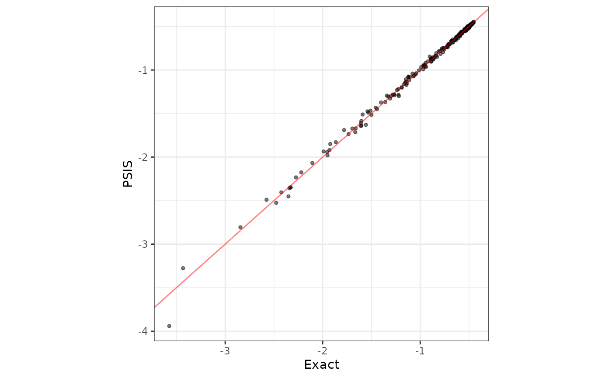
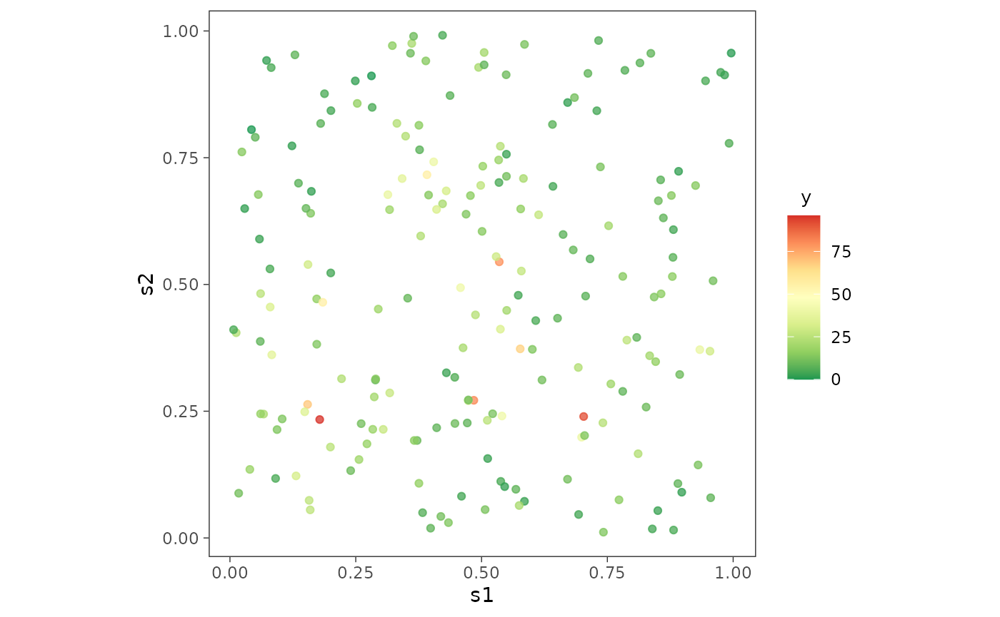
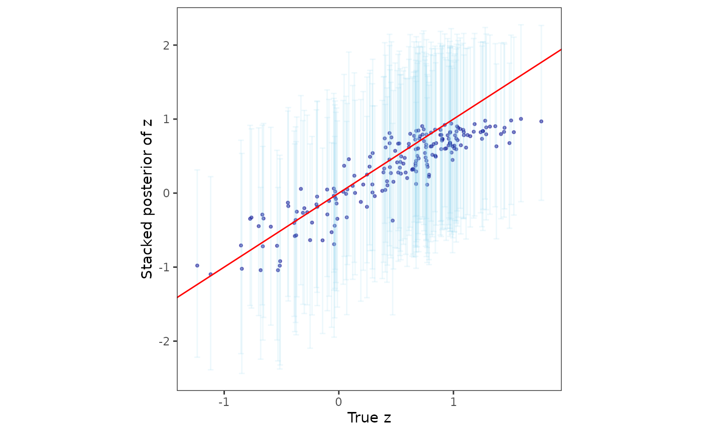
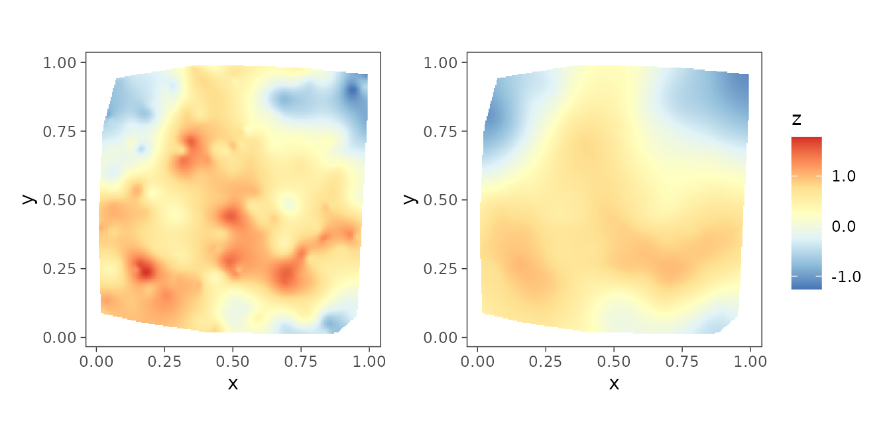

# Spatial Regression Models

In this article, we discuss the following functions -

- [`spLMexact()`](https://span-18.github.io/spStack-dev/reference/spLMexact.md)
- [`spLMstack()`](https://span-18.github.io/spStack-dev/reference/spLMstack.md)
- [`spGLMexact()`](https://span-18.github.io/spStack-dev/reference/spGLMexact.md)
- [`spGLMstack()`](https://span-18.github.io/spStack-dev/reference/spGLMstack.md)

These functions can be used to fit Gaussian and non-Gaussian spatial
point-referenced data.

``` r
set.seed(1729)
```

## Bayesian Gaussian spatial regression models

In this section, we thoroughly illustrate our method on synthetic
Gaussian as well as non-Gaussian spatial data and provide code to
analyze the output of our functions. We start by loading the package.

``` r
library(spStack)
library(ggplot2)
library(patchwork)
```

Some synthetic spatial data are lazy-loaded which includes synthetic
spatial Gaussian data `simGaussian`, Poisson data `simPoisson`, binomial
data `simBinom` and binary data `simBinary`. One can use the function
[`sim_spData()`](https://span-18.github.io/spStack-dev/reference/sim_spData.md)
to simulate spatial data. We will be applying our functions on these
datasets.

### Using fixed hyperparameters

We first load the data `simGaussian` and set up the priors. Supplying
the priors is optional. See the documentation of
[`spLMexact()`](https://span-18.github.io/spStack-dev/reference/spLMexact.md)
to learn more about the default priors. Besides, setting the priors, we
also fix the values of the spatial process parameters (spatial decay
$\phi$ and smoothness $\nu$) and the noise-to-spatial variance ratio
($\delta^{2}$).

``` r
data("simGaussian")
dat <- simGaussian[1:200, ] # work with first 200 rows

muBeta <- c(0, 0)
VBeta <- cbind(c(1E4, 0.0), c(0.0, 1E4))
sigmaSqIGa <- 2
sigmaSqIGb <- 2
phi0 <- 3
nu0 <- 0.5
noise_sp_ratio <- 0.8
prior_list <- list(beta.norm = list(muBeta, VBeta),
                   sigma.sq.ig = c(sigmaSqIGa, sigmaSqIGb))
nSamples <- 1000
```

We define the spatial model using a `formula`, similar to that in the
widely used [`lm()`](https://rdrr.io/r/stats/lm.html) function in the
`stats` package. Here, the formula `y ~ x1` corresponds to the spatial
linear model
$$y(s) = \beta_{0} + \beta_{1}x_{1}(s) + z(s) + \epsilon(s)\;,$$ where
the `y` corresponds to the response variable $y(s)$, which is regressed
on the predictor `x1` given by $x_{1}(s)$. The intercept is
automatically considered within the model, and hence `y ~ x1` is
functionally equivalent to `y ~ 1 + x1`. Moreover, a spatial random
effect is inherent in the model, where the spatial correlation matrix is
governed by the spatial correlation function specified by the argument
`cor.fn`. Supported correlation functions are `"exponential"` and
`"matern"`. The exponential covariogram is specified by the
hyperparameter $\phi$ and the Matern covariogram is specified by the
hyperparameters $\phi$ and $\nu$. Fixed values of these hyperparameters
are supplied through the argument `spParams`. In addition, the
noise-to-spatial variance ration is also fixed through the argument
`noise_sp_ratio`.

If interested in calculation of leave-one-out predictive densities
(LOO-PD), `loopd` must be set `TRUE` (the default is `FALSE`). Method of
LOO-PD calculation can be also set by the option `loopd.method` which
support the keywords `"exact"` and `"psis"`. The option `"exact"`
exploits the analytically available expressions of the predictive
density and implements an efficient row-deletion Cholesky factor update
for fast calculation and avoids refitting the model $n$ times, where $n$
is the sample size. On the other hand, `"psis"` implements
Pareto-smoothed importance sampling and finds approximate LOO-PD and is
much faster than `"exact"`.

We pass these arguments into the function
[`spLMexact()`](https://span-18.github.io/spStack-dev/reference/spLMexact.md).

``` r
mod1 <- spLMexact(y ~ x1, data = dat,
                  coords = as.matrix(dat[, c("s1", "s2")]),
                  cor.fn = "matern",
                  priors = prior_list,
                  spParams = list(phi = phi0, nu = nu0),
                  noise_sp_ratio = noise_sp_ratio, n.samples = nSamples,
                  loopd = TRUE, loopd.method = "exact",
                  verbose = TRUE)
#> ----------------------------------------
#>  Model description
#> ----------------------------------------
#> Model fit with 200 observations.
#> 
#> Number of covariates 2 (including intercept).
#> 
#> Using the matern spatial correlation function.
#> 
#> Priors:
#>  beta: Gaussian
#>  mu: 0.00    0.00    
#>  cov:
#>   10000.00    0.00   
#>   0.00    10000.00   
#> 
#>  sigma.sq: Inverse-Gamma
#>  shape = 2.00, scale = 2.00.
#> 
#> Spatial process parameters:
#>  phi = 3.00, and, nu = 0.50.
#> Noise-to-spatial variance ratio = 0.80.
#> 
#> Number of posterior samples = 1000.
#> 
#> LOO-PD calculation method = exact.
#> ----------------------------------------
```

Next, we can summarize the posterior samples of the fixed effects as
follows.

``` r
post_beta <- mod1$samples$beta
summary_beta <- t(apply(post_beta, 1, function(x) quantile(x, c(0.025, 0.5, 0.975))))
rownames(summary_beta) <- mod1$X.names
print(summary_beta)
#>                 2.5%      50%    97.5%
#> (Intercept) 1.688957 2.284946 2.955524
#> x1          4.866534 4.954401 5.040862
```

### Leave-one-out predictive densities using PSIS

Out of curiosity, we find the LOO-PD for the same model using the
approximate method that uses Pareto-smoothed importance sampling, or
PSIS. See Vehtari, Gelman, and Gabry ([2017](#ref-LOOCV_vehtari17)) for
details.

``` r
mod2 <- spLMexact(y ~ x1, data = dat,
                  coords = as.matrix(dat[, c("s1", "s2")]),
                  cor.fn = "matern",
                  priors = prior_list,
                  spParams = list(phi = phi0, nu = nu0),
                  noise_sp_ratio = noise_sp_ratio, n.samples = nSamples,
                  loopd = TRUE, loopd.method = "PSIS",
                  verbose = FALSE)
```

Subsquently, we compare the LOO-PD obtained by the two methods.

``` r
loopd_exact <- mod1$loopd
loopd_psis <- mod2$loopd
loopd_df <- data.frame(exact = loopd_exact, psis = loopd_psis)

library(ggplot2)
plot1 <- ggplot(data = loopd_df, aes(x = exact)) +
  geom_point(aes(y = psis), size = 1, alpha = 0.5) +
  geom_abline(slope = 1, intercept = 0, color = "red", alpha = 0.5) +
  xlab("Exact") + ylab("PSIS") + theme_bw() +
  theme(panel.background = element_blank(),
        panel.grid = element_blank(), aspect.ratio = 1)
plot1
```



### Using predictive stacking

Next, we move on to the Bayesian spatial stacking algorithm for Gaussian
data. We supply the same prior list and provide some candidate values of
spatial process parameters and noise-to-spatial variance ratio.

``` r
mod3 <- spLMstack(y ~ x1, data = dat,
                  coords = as.matrix(dat[, c("s1", "s2")]),
                  cor.fn = "matern",
                  priors = prior_list,
                  params.list = list(phi = c(1.5, 3, 5),
                                     nu = c(0.5, 1, 1.5),
                                     noise_sp_ratio = c(0.5, 1.5)),
                  n.samples = 1000, loopd.method = "exact",
                  parallel = FALSE, verbose = TRUE)
#> --------------------------------------------------
#> Solver diagnostics:
#> Installed solvers: CLARABEL, SCS, OSQP, HIGHS
#> Requested solver: DEFAULT (CLARABEL -> ECOS -> SCS)
#> Solver search order: CLARABEL -> SCS
#> --------------------------------------------------
#> ────────────────────────────────── CVXR v1.8.1 ─────────────────────────────────
#> ℹ Problem: 1 variable, 2 constraints (DCP)
#> ℹ Compilation: "CLARABEL" via CVXR::FlipObjective -> CVXR::Dcp2Cone -> CVXR::CvxAttr2Constr -> CVXR::ConeMatrixStuffing -> CVXR::Clarabel_Solver
#> ℹ Compile time: 0.956s
#> ─────────────────────────────── Numerical solver ───────────────────────────────
#> ──────────────────────────────────── Summary ───────────────────────────────────
#> ✔ Status: optimal
#> ✔ Optimal value: -113.076
#> ℹ Compile time: 0.956s
#> ℹ Solver time: 0.032s
#> 
#> STACKING WEIGHTS:
#> 
#>            | phi | nu  | noise_sp_ratio | weight |
#> +----------+-----+-----+----------------+--------+
#> | Model 1  |  1.5|  0.5|             0.5| 0.000  |
#> | Model 2  |  3.0|  0.5|             0.5| 0.000  |
#> | Model 3  |  5.0|  0.5|             0.5| 0.000  |
#> | Model 4  |  1.5|  1.0|             0.5| 0.242  |
#> | Model 5  |  3.0|  1.0|             0.5| 0.000  |
#> | Model 6  |  5.0|  1.0|             0.5| 0.751  |
#> | Model 7  |  1.5|  1.5|             0.5| 0.000  |
#> | Model 8  |  3.0|  1.5|             0.5| 0.000  |
#> | Model 9  |  5.0|  1.5|             0.5| 0.000  |
#> | Model 10 |  1.5|  0.5|             1.5| 0.000  |
#> | Model 11 |  3.0|  0.5|             1.5| 0.000  |
#> | Model 12 |  5.0|  0.5|             1.5| 0.000  |
#> | Model 13 |  1.5|  1.0|             1.5| 0.000  |
#> | Model 14 |  3.0|  1.0|             1.5| 0.000  |
#> | Model 15 |  5.0|  1.0|             1.5| 0.006  |
#> | Model 16 |  1.5|  1.5|             1.5| 0.000  |
#> | Model 17 |  3.0|  1.5|             1.5| 0.000  |
#> | Model 18 |  5.0|  1.5|             1.5| 0.000  |
#> +----------+-----+-----+----------------+--------+
```

The user can check the solver status and runtime by issuing the
following.

``` r
print(mod3$solver)
#> [1] "CVXR:CLARABEL"
print(mod3$solver.status)
#> [1] "optimal"
print(mod3$run.time)
#>    user  system elapsed 
#>   4.307   2.245   2.662
```

### Analyzing samples from the stacked posterior

To sample from the stacked posterior, the package provides a helper
function called
[`stackedSampler()`](https://span-18.github.io/spStack-dev/reference/stackedSampler.md).
Subsequent inference proceeds from these samples obtained from the
stacked posterior.

``` r
post_samps <- stackedSampler(mod3)
```

We then collect the samples of the fixed effects and summarize them as
follows.

``` r
post_beta <- post_samps$beta
summary_beta <- t(apply(post_beta, 1, function(x) quantile(x, c(0.025, 0.5, 0.975))))
rownames(summary_beta) <- mod3$X.names
print(summary_beta)
#>                  2.5%      50%    97.5%
#> (Intercept) 0.9540551 2.220069 3.057419
#> x1          4.8672400 4.949081 5.036638
```

The synthetic data `simGaussian` was simulated using the true value
$\beta = (2,5)^{\top}$. We notice that the stacked posterior is
concentrated around the truth.

``` r
library(tidyr)
library(dplyr)
#> 
#> Attaching package: 'dplyr'
#> The following objects are masked from 'package:stats':
#> 
#>     filter, lag
#> The following objects are masked from 'package:base':
#> 
#>     intersect, setdiff, setequal, union

post_beta_df <- as.data.frame(post_beta)
post_beta_df <- post_beta_df %>%
  mutate(row = paste0("beta", row_number()-1)) %>%
  pivot_longer(-row, names_to = "sample", values_to = "value")

# True values of beta0 and beta1
truth <- data.frame(row = c("beta0", "beta1"), true_value = c(2, 5))

ggplot(post_beta_df, aes(x = value)) +
  geom_density(fill = "lightblue", alpha = 0.6) +
  geom_vline(data = truth, aes(xintercept = true_value),
             color = "red", linetype = "dashed", linewidth = 0.5) +
  facet_wrap(~ row, scales = "free") + labs(x = "", y = "Density") +
  theme_bw() + theme(panel.background = element_blank(),
                     panel.grid = element_blank(), aspect.ratio = 1)
```


Furthermore, we compare the posterior samples of the spatial random
effects with their corresponding true values.

``` r
post_z <- post_samps$z
post_z_summ <- t(apply(post_z, 1, function(x) quantile(x, c(0.025, 0.5, 0.975))))
z_combn <- data.frame(z = dat$z_true, zL = post_z_summ[, 1],
                      zM = post_z_summ[, 2], zU = post_z_summ[, 3])

plotz <- ggplot(data = z_combn, aes(x = z)) +
  geom_point(aes(y = zM), size = 0.75, color = "darkblue", alpha = 0.5) +
  geom_errorbar(aes(ymin = zL, ymax = zU), width = 0.05, alpha = 0.15,
                color = "skyblue") +
  geom_abline(slope = 1, intercept = 0, color = "red") +
  xlab("True z") + ylab("Stacked posterior of z") + theme_bw() +
  theme(panel.background = element_blank(),
        panel.grid = element_blank(), aspect.ratio = 1)
plotz
```


The package also provides helper functions to plot interpolated spatial
surfaces in order for visualization purposes. The function
[`surfaceplot()`](https://span-18.github.io/spStack-dev/reference/surfaceplot.md)
creates a single spatial surface plot, while
[`surfaceplot2()`](https://span-18.github.io/spStack-dev/reference/surfaceplot2.md)
creates two side-by-side surface plots. We are using the later to
visually inspect the interpolated spatial surfaces of the true spatial
effects and their posterior medians.

``` r
postmedian_z <- apply(post_z, 1, median)
dat$z_hat <- postmedian_z
plot_z <- surfaceplot2(dat, coords_name = c("s1", "s2"),
                       var1_name = "z_true", var2_name = "z_hat")
#> Warning: `aes_string()` was deprecated in ggplot2 3.0.0.
#> ℹ Please use tidy evaluation idioms with `aes()`.
#> ℹ See also `vignette("ggplot2-in-packages")` for more information.
#> ℹ The deprecated feature was likely used in the spStack package.
#>   Please report the issue at <https://github.com/SPan-18/spStack-dev/issues>.
#> This warning is displayed once per session.
#> Call `lifecycle::last_lifecycle_warnings()` to see where this warning was
#> generated.
patchwork::wrap_plots(plot_z) +
    patchwork::plot_layout(guides = "collect") &
    ggplot2::theme(legend.position = "right")
```


### Analysis of spatial non-Gaussian data

We also offer functions for Bayesian analysis of spatially
point-referenced Poisson, binomial count, and binary data.

#### Spatial Poisson count data

We first load and plot the point-referenced Poisson count data.

``` r
data("simPoisson")
dat <- simPoisson[1:200, ] # work with first 200 observations

ggplot(dat, aes(x = s1, y = s2)) +
  geom_point(aes(color = y), alpha = 0.75) +
  scale_color_distiller(palette = "RdYlGn", direction = -1,
                        label = function(x) sprintf("%.0f", x)) +
  guides(alpha = 'none') + theme_bw() +
  theme(axis.ticks = element_line(linewidth = 0.25),
        panel.background = element_blank(), panel.grid = element_blank(),
        legend.title = element_text(size = 10, hjust = 0.25),
        legend.box.just = "center", aspect.ratio = 1)
```



#### Under fixed hyperparameters

Next, we demonstrate the function
[`spGLMexact()`](https://span-18.github.io/spStack-dev/reference/spGLMexact.md)
which delivers posterior samples of the fixed effects and the spatial
random effects. The option `family` must be specified correctly while
using this function. For instance, in the following example, the formula
`y ~ x1` and `family = "poisson"` corresponds to the spatial regression
model
$$y(s) \sim {\mathsf{P}\mathsf{o}\mathsf{i}\mathsf{s}\mathsf{s}\mathsf{o}\mathsf{n}}\left( \lambda(s) \right),\quad\log\lambda(s) = \beta_{0} + \beta_{1}x_{1}(s) + z(s)\;.$$

We provide fixed values of the spatial process parameters and a boundary
adjustment parameter, given by the argument `boundary`, which if not
supplied, defaults to 0.5. For details on the priors and its default
value, see function documentation.

``` r
mod1 <- spGLMexact(y ~ x1, data = dat, family = "poisson",
                   coords = as.matrix(dat[, c("s1", "s2")]), cor.fn = "matern",
                   spParams = list(phi = phi0, nu = nu0),
                   priors = list(nu.beta = 5, nu.z = 5),
                   boundary = 0.5,
                   n.samples = 1000, verbose = TRUE)
#> Some priors were not supplied. Using defaults.
#> ----------------------------------------
#>  Model description
#> ----------------------------------------
#> Model fit with 200 observations.
#> 
#> Family = poisson.
#> 
#> Number of covariates 2 (including intercept).
#> 
#> Using the matern spatial correlation function.
#> 
#> Priors:
#>  beta: Gaussian
#>  mu: 0.00    0.00    
#>  cov:
#>   100.00  0.00   
#>   0.00    100.00 
#> 
#>  sigmaSq.beta ~ IG(nu.beta/2, nu.beta/2)
#>  sigmaSq.z ~ IG(nu.z/2, nu.z/2)
#>  nu.beta = 5.00, nu.z = 5.00.
#>  sigmaSq.xi = 0.10.
#>  Boundary adjustment parameter = 0.50.
#> 
#> Spatial process parameters:
#>  phi = 3.00, and, nu = 0.50.
#> 
#> Number of posterior samples = 1000.
#> ----------------------------------------
```

We next collect the samples of the fixed effects and summarize them. The
true value of the fixed effects with which the data was simulated is
$\beta = (2, - 0.5)$ (for more details, see the documentation of the
data `simPoisson`).

``` r
post_beta <- mod1$samples$beta
summary_beta <- t(apply(post_beta, 1, function(x) quantile(x, c(0.025, 0.5, 0.975))))
rownames(summary_beta) <- mod1$X.names
print(summary_beta)
#>                   2.5%        50%      97.5%
#> (Intercept)  0.7767448  2.0431825  3.1654221
#> x1          -0.6480264 -0.5517039 -0.4539841
```

#### Posterior recovery of scale parameters

The analytic tractability of the posterior distribution under the
$\mathsf{G}\mathsf{C}\mathsf{M}$ framework is enabled by marginalizing
out the scale parameters $\sigma_{\beta}^{2}$ and $\sigma_{z}^{2}$
associated with the fixed effects $\beta$ and the spatial random effects
$z$, respectively. However, posterior samples of $\sigma_{\beta}^{2}$
and $\sigma_{z}^{2}$ can be recovered using the function
[`recoverGLMscale()`](https://span-18.github.io/spStack-dev/reference/recoverGLMscale.md).

``` r
mod1 <- recoverGLMscale(mod1)
```

We visualize the posterior distributions of $\sigma_{\beta}$ and
$\sigma_{z}$ through histograms.

``` r
post_scale_df <- data.frame(value = sqrt(c(mod1$samples$sigmasq.beta, mod1$samples$sigmasq.z)),
                            group = factor(rep(c("sigma.beta", "sigma.z"),
                                    each = length(mod1$samples$sigmasq.beta))))
ggplot(post_scale_df, aes(x = value)) +
  geom_density(fill = "lightblue", alpha = 0.6) +
  facet_wrap(~ group, scales = "free") + labs(x = "", y = "Density") +
  theme_bw() + theme(panel.background = element_blank(),
                     panel.grid = element_blank(), aspect.ratio = 1)
```


#### Using predictive stacking

Next, we move on to the function
[`spGLMstack()`](https://span-18.github.io/spStack-dev/reference/spGLMstack.md)
that will implement our proposed stacking algorithm. The argument
`loopd.controls` is used to provide details on what algorithm to be used
to find LOO-PD. Valid options for the tag `method` is `"exact"` and
`"CV"`. We use $K$-fold cross-validation by assigning `method = "CV"`and
`CV.K = 10`. The tag `nMC` decides the number of Monte Carlo samples to
be used to find the LOO-PD.

``` r
mod2 <- spGLMstack(y ~ x1, data = dat, family = "poisson",
                   coords = as.matrix(dat[, c("s1", "s2")]), cor.fn = "matern",
                   params.list = list(phi = c(3, 7, 10), nu = c(0.5, 1.5),
                                      boundary = c(0.5, 0.6)),
                   n.samples = 1000, priors = list(mu.beta = 5, nu.z = 5),
                   loopd.controls = list(method = "CV", CV.K = 10, nMC = 1000),
                   parallel = TRUE, verbose = TRUE)
#> Some priors were not supplied. Using defaults.
#> --------------------------------------------------
#> Solver diagnostics:
#> Installed solvers: CLARABEL, SCS, OSQP, HIGHS
#> Requested solver: DEFAULT (CLARABEL -> ECOS -> SCS)
#> Solver search order: CLARABEL -> SCS
#> --------------------------------------------------
#> ────────────────────────────────── CVXR v1.8.1 ─────────────────────────────────
#> ℹ Problem: 1 variable, 2 constraints (DCP)
#> ℹ Compilation: "CLARABEL" via CVXR::FlipObjective -> CVXR::Dcp2Cone -> CVXR::CvxAttr2Constr -> CVXR::ConeMatrixStuffing -> CVXR::Clarabel_Solver
#> ℹ Compile time: 0.206s
#> ─────────────────────────────── Numerical solver ───────────────────────────────
#> ──────────────────────────────────── Summary ───────────────────────────────────
#> ✔ Status: optimal
#> ✔ Optimal value: -311.489
#> ℹ Compile time: 0.206s
#> ℹ Solver time: 0.044s
#> 
#> STACKING WEIGHTS:
#> 
#>            | phi | nu  | boundary | weight |
#> +----------+-----+-----+----------+--------+
#> | Model 1  |    3|  0.5|       0.5| 0.000  |
#> | Model 2  |    7|  0.5|       0.5| 0.000  |
#> | Model 3  |   10|  0.5|       0.5| 0.000  |
#> | Model 4  |    3|  1.5|       0.5| 0.000  |
#> | Model 5  |    7|  1.5|       0.5| 0.000  |
#> | Model 6  |   10|  1.5|       0.5| 0.000  |
#> | Model 7  |    3|  0.5|       0.6| 0.000  |
#> | Model 8  |    7|  0.5|       0.6| 0.000  |
#> | Model 9  |   10|  0.5|       0.6| 0.000  |
#> | Model 10 |    3|  1.5|       0.6| 0.005  |
#> | Model 11 |    7|  1.5|       0.6| 0.724  |
#> | Model 12 |   10|  1.5|       0.6| 0.272  |
#> +----------+-----+-----+----------+--------+
```

We can extract information on solver status and runtime by the
following.

``` r
print(mod2$solver)
#> [1] "CVXR:CLARABEL"
print(mod2$solver.status)
#> [1] "optimal"
print(mod2$run.time)
#>    user  system elapsed 
#>  35.344  25.479  15.543
```

Further, we can recover the posterior samples of the scale parameters by
passing the output obtained by running
[`spGLMstack()`](https://span-18.github.io/spStack-dev/reference/spGLMstack.md)
once again through
[`recoverGLMscale()`](https://span-18.github.io/spStack-dev/reference/recoverGLMscale.md).

``` r
mod2 <- recoverGLMscale(mod2)
```

#### Sampling from stacked posterior

We first obtain final posterior samples by sampling from the stacked
sampler.

``` r
post_samps <- stackedSampler(mod2)
```

Subsequently, we summarize the posterior samples of the fixed effects.

``` r
post_beta <- post_samps$beta
summary_beta <- t(apply(post_beta, 1, function(x) quantile(x, c(0.025, 0.5, 0.975))))
rownames(summary_beta) <- mod3$X.names
print(summary_beta)
#>                   2.5%        50%      97.5%
#> (Intercept)  1.1209791  2.1014709  3.0766891
#> x1          -0.6233661 -0.5472512 -0.4717314
```

The synthetic data `simPoisson` was simulated using
$\beta = (2, - 0.5)^{\top}$.

``` r
post_beta_df <- as.data.frame(post_beta)
post_beta_df <- post_beta_df %>%
  mutate(row = paste0("beta", row_number()-1)) %>%
  pivot_longer(-row, names_to = "sample", values_to = "value")

# True values of beta0 and beta1
truth <- data.frame(row = c("beta0", "beta1"), true_value = c(2, -0.5))

ggplot(post_beta_df, aes(x = value)) +
  geom_density(fill = "lightblue", alpha = 0.6) +
  geom_vline(data = truth, aes(xintercept = true_value),
             color = "red", linetype = "dashed", linewidth = 0.5) +
  facet_wrap(~ row, scales = "free") + labs(x = "", y = "Density") +
  theme_bw() + theme(panel.background = element_blank(),
                     panel.grid = element_blank(), aspect.ratio = 1)
```


Finally, we analyze the posterior samples of the spatial random effects.

``` r
post_z <- post_samps$z
post_z_summ <- t(apply(post_z, 1, function(x) quantile(x, c(0.025, 0.5, 0.975))))
z_combn <- data.frame(z = dat$z_true, zL = post_z_summ[, 1],
                      zM = post_z_summ[, 2], zU = post_z_summ[, 3])

plotz <- ggplot(data = z_combn, aes(x = z)) +
  geom_point(aes(y = zM), size = 0.75, color = "darkblue", alpha = 0.5) +
  geom_errorbar(aes(ymin = zL, ymax = zU), width = 0.05, alpha = 0.15,
                color = "skyblue") +
  geom_abline(slope = 1, intercept = 0, color = "red") +
  xlab("True z") + ylab("Stacked posterior of z") + theme_bw() +
  theme(panel.background = element_blank(),
        panel.grid = element_blank(), aspect.ratio = 1)
plotz
```



We can also compare the interpolated spatial surfaces of the true
spatial effects with that of their posterior median.

``` r
postmedian_z <- apply(post_z, 1, median)
dat$z_hat <- postmedian_z
plot_z <- surfaceplot2(dat, coords_name = c("s1", "s2"),
                       var1_name = "z_true", var2_name = "z_hat")
patchwork::wrap_plots(plot_z) +
    patchwork::plot_layout(guides = "collect") &
    ggplot2::theme(legend.position = "right")
```



### Spatial binomial count data

This will follow the same workflow as Poisson data with the exception
that the structure of `formula` that defines the model will also contain
the total number of trials at each location. Here, we present only the
[`spGLMexact()`](https://span-18.github.io/spStack-dev/reference/spGLMexact.md)
function for brevity.

``` r
data("simBinom")
dat <- simBinom[1:200, ] # work with first 200 rows

mod1 <- spGLMexact(cbind(y, n_trials) ~ x1, data = dat, family = "binomial",
                   coords = as.matrix(dat[, c("s1", "s2")]), cor.fn = "matern",
                   spParams = list(phi = 3, nu = 0.5),
                   boundary = 0.5, n.samples = 1000, verbose = FALSE)
```

Similarly, we collect the posterior samples of the fixed effects and
summarize them. The true value of the fixed effects with which the data
was simulated is $\beta = (0.5, - 0.5)$.

``` r
post_beta <- mod1$samples$beta
summary_beta <- t(apply(post_beta, 1, function(x) quantile(x, c(0.025, 0.5, 0.975))))
rownames(summary_beta) <- mod1$X.names
print(summary_beta)
#>                   2.5%        50%      97.5%
#> (Intercept) -1.2273338  0.7281044  2.7618818
#> x1          -0.5837158 -0.4047673 -0.2188961
```

### Spatial binary data

Finally, we present only the
[`spGLMexact()`](https://span-18.github.io/spStack-dev/reference/spGLMexact.md)
function for spatial binary data to avoid repetition. In this case,
unlike the binomial model, almost nothing changes from that of in the
case of spatial Poisson data.

``` r
data("simBinary")
dat <- simBinary[1:200, ]

mod1 <- spGLMexact(y ~ x1, data = dat, family = "binary",
                   coords = as.matrix(dat[, c("s1", "s2")]), cor.fn = "matern",
                   spParams = list(phi = 4, nu = 0.4),
                   boundary = 0.5, n.samples = 1000, verbose = FALSE)
```

Similarly, we collect the posterior samples of the fixed effects and
summarize them. The true value of the fixed effects with which the data
was simulated is $\beta = (0.5, - 0.5)$.

``` r
post_beta <- mod1$samples$beta
summary_beta <- t(apply(post_beta, 1, function(x) quantile(x, c(0.025, 0.5, 0.975))))
rownames(summary_beta) <- mod1$X.names
print(summary_beta)
#>                   2.5%        50%      97.5%
#> (Intercept) -1.2015085  0.3212393 2.20401790
#> x1          -0.6653012 -0.3229634 0.07179601
```

## References

Vehtari, Aki, Andrew Gelman, and Jonah Gabry. 2017. “Practical Bayesian
Model Evaluation Using Leave-One-Out Cross-Validation and WAIC.”
*Statistics and Computing* 27 (5): 1413–32.
<https://doi.org/10.1007/s11222-016-9696-4>.
