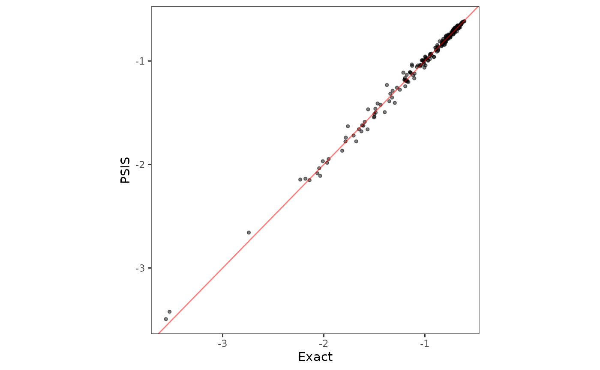
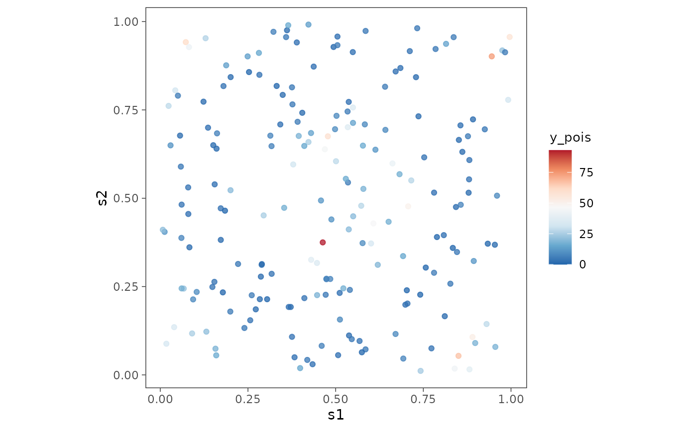
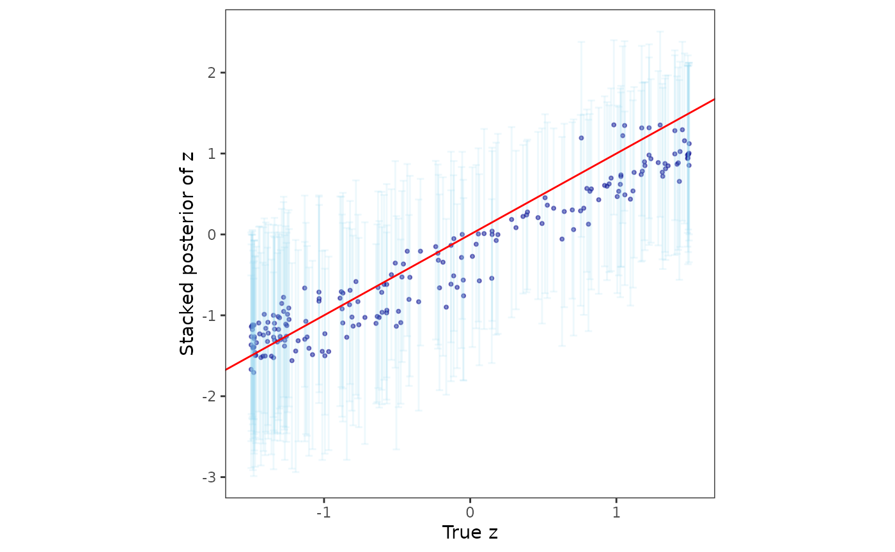
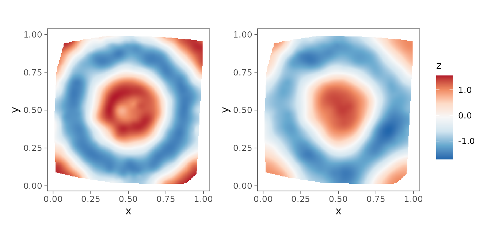

# Spatial Regression Models

In this article, we discuss the following functions -

- [`spLMexact()`](https://span-18.github.io/spStack-dev/reference/spLMexact.md)
- [`spLMstack()`](https://span-18.github.io/spStack-dev/reference/spLMstack.md)
- [`spGLMexact()`](https://span-18.github.io/spStack-dev/reference/spGLMexact.md)
- [`spGLMstack()`](https://span-18.github.io/spStack-dev/reference/spGLMstack.md)
- [`stvcLMexact()`](https://span-18.github.io/spStack-dev/reference/stvcLMexact.md)
  and
  [`stvcLMstack()`](https://span-18.github.io/spStack-dev/reference/stvcLMstack.md)
  (spatially varying coefficients)

These functions can be used to fit Gaussian and non-Gaussian spatial
point-referenced data.

``` r

set.seed(1729)
```

## Bayesian Gaussian spatial regression models

In this section, we thoroughly illustrate our method on synthetic
Gaussian as well as non-Gaussian spatial data and provide code to
analyze the output of our functions. We start by loading the package.

``` r

library(spStack)
library(ggplot2)
library(patchwork)
```

The package lazy-loads the synthetic dataset `simSpatial`, observed at
500 locations in the unit square. It has two covariates `x1` and `x2`, a
spatial effect `z_true` with a ripple pattern,
$`z(s) = 1.5 \sin(4\pi \lVert s - (0.5, 0.5) \rVert)`$, and one response
for each family: Gaussian `y_gauss`, Poisson `y_pois`, binomial
`y_binom` (out of `n_trials` trials) and binary `y_bin`. All the
responses share the covariates and the spatial effect, so we apply every
function in this article to the same data. The spatial effect is a
deterministic surface, not a draw from a Gaussian process, so we can see
how well the Gaussian process models recover it. See
[`?simSpatial`](https://span-18.github.io/spStack-dev/reference/simSpatial.md)
for the code that generated the data.

``` r

data("simSpatial")
surfaceplot(simSpatial, coords_name = c("s1", "s2"), var_name = "z_true")
#> Warning: `aes_string()` was deprecated in ggplot2 3.0.0.
#> ℹ Please use tidy evaluation idioms with `aes()`.
#> ℹ See also `vignette("ggplot2-in-packages")` for more information.
#> ℹ The deprecated feature was likely used in the spStack package.
#>   Please report the issue at <https://github.com/SPan-18/spStack-dev/issues>.
#> This warning is displayed once per session.
#> Call `lifecycle::last_lifecycle_warnings()` to see where this warning was
#> generated.
```


### Using fixed hyperparameters

We first take the first 200 rows of the data and set up the priors.
Supplying the priors is optional. See the documentation of
[`spLMexact()`](https://span-18.github.io/spStack-dev/reference/spLMexact.md)
to learn more about the default priors. Besides, setting the priors, we
also fix the values of the spatial process parameters (spatial decay
$`\phi`$ and smoothness $`\nu`$) and the noise-to-spatial variance ratio
($`\delta^2`$).

``` r

dat <- simSpatial[1:200, ] # work with first 200 rows

muBeta <- c(0, 0, 0)
VBeta <- diag(1E4, 3)
sigmaSqIGa <- 2
sigmaSqIGb <- 2
phi0 <- 6
nu0 <- 0.5
noise_sp_ratio <- 0.8
prior_list <- list(beta.norm = list(muBeta, VBeta),
                   sigma.sq.ig = c(sigmaSqIGa, sigmaSqIGb))
nSamples <- 1000
```

We define the spatial model using a `formula`, similar to that in the
widely used [`lm()`](https://rdrr.io/r/stats/lm.html) function in the
`stats` package. Here, the formula `y_gauss ~ x1 + x2` corresponds to
the spatial linear model
``` math
y(s) = \beta_0 + \beta_1 x_1(s) + \beta_2 x_2(s) + z(s) + \epsilon(s)\;,
```
where `y_gauss` corresponds to the response variable $`y(s)`$, which is
regressed on the predictors `x1` and `x2` given by $`x_1(s)`$ and
$`x_2(s)`$. The intercept is automatically considered within the model,
and hence `y_gauss ~ x1 + x2` is functionally equivalent to
`y_gauss ~ 1 + x1 + x2`. Moreover, a spatial random effect is inherent
in the model, where the spatial correlation matrix is governed by the
spatial correlation function specified by the argument `cor.fn`.
Supported correlation functions are `"exponential"` and `"matern"`. The
exponential covariogram is specified by the hyperparameter $`\phi`$ and
the Matern covariogram is specified by the hyperparameters $`\phi`$ and
$`\nu`$. Fixed values of these hyperparameters are supplied through the
argument `spParams`. In addition, the noise-to-spatial variance ration
is also fixed through the argument `noise_sp_ratio`.

If interested in calculation of leave-one-out predictive densities
(LOO-PD), `loopd` must be set `TRUE` (the default is `FALSE`). Method of
LOO-PD calculation can be also set by the option `loopd.method` which
support the keywords `"exact"` and `"psis"`. The option `"exact"`
exploits the analytically available expressions of the predictive
density and implements an efficient row-deletion Cholesky factor update
for fast calculation and avoids refitting the model $`n`$ times, where
$`n`$ is the sample size. On the other hand, `"psis"` implements
Pareto-smoothed importance sampling and finds approximate LOO-PD and is
much faster than `"exact"`.

We pass these arguments into the function
[`spLMexact()`](https://span-18.github.io/spStack-dev/reference/spLMexact.md).

``` r

mod1 <- spLMexact(y_gauss ~ x1 + x2, data = dat,
                  coords = as.matrix(dat[, c("s1", "s2")]),
                  cor.fn = "matern",
                  priors = prior_list,
                  spParams = list(phi = phi0, nu = nu0),
                  noise_sp_ratio = noise_sp_ratio, n.samples = nSamples,
                  loopd = TRUE, loopd.method = "exact",
                  verbose = TRUE)
#> ----------------------------------------
#>  Model description
#> ----------------------------------------
#> Model fit with 200 observations.
#> 
#> Number of covariates 3 (including intercept).
#> 
#> Using the matern spatial correlation function.
#> 
#> Priors:
#>  beta: Gaussian
#>  mu: 0.00    0.00    0.00    
#>  cov:
#>   10000.00    0.00    0.00   
#>   0.00    10000.00    0.00   
#>   0.00    0.00    10000.00   
#> 
#>  sigma.sq: Inverse-Gamma
#>  shape = 2.00, scale = 2.00.
#> 
#> Spatial process parameters:
#>  phi = 6.00, and, nu = 0.50.
#> Noise-to-spatial variance ratio = 0.80.
#> 
#> Number of posterior samples = 1000.
#> 
#> LOO-PD calculation method = exact.
#> ----------------------------------------
```

Next, we can summarize the posterior samples of the fixed effects as
follows.

``` r

post_beta <- mod1$samples$beta
summary_beta <- t(apply(post_beta, 1, function(x) quantile(x, c(0.025, 0.5, 0.975))))
rownames(summary_beta) <- mod1$X.names
print(summary_beta)
#>                  2.5%       50%      97.5%
#> (Intercept)  1.655699  2.112780  2.5303184
#> x1           4.815622  4.914532  5.0015428
#> x2          -1.119396 -1.022034 -0.9191784
```

### Leave-one-out predictive densities using PSIS

Out of curiosity, we find the LOO-PD for the same model using the
approximate method that uses Pareto-smoothed importance sampling, or
PSIS. See Vehtari et al. ([2017](#ref-LOOCV_vehtari17)) for details.

``` r

mod2 <- spLMexact(y_gauss ~ x1 + x2, data = dat,
                  coords = as.matrix(dat[, c("s1", "s2")]),
                  cor.fn = "matern",
                  priors = prior_list,
                  spParams = list(phi = phi0, nu = nu0),
                  noise_sp_ratio = noise_sp_ratio, n.samples = nSamples,
                  loopd = TRUE, loopd.method = "PSIS",
                  verbose = FALSE)
```

Subsquently, we compare the LOO-PD obtained by the two methods.

``` r

loopd_exact <- mod1$loopd
loopd_psis <- mod2$loopd
loopd_df <- data.frame(exact = loopd_exact, psis = loopd_psis)

library(ggplot2)
plot1 <- ggplot(data = loopd_df, aes(x = exact)) +
  geom_point(aes(y = psis), size = 1, alpha = 0.5) +
  geom_abline(slope = 1, intercept = 0, color = "red", alpha = 0.5) +
  xlab("Exact") + ylab("PSIS") + theme_bw() +
  theme(panel.background = element_blank(),
        panel.grid = element_blank(), aspect.ratio = 1)
plot1
```



### Using predictive stacking

Next, we move on to the Bayesian spatial stacking algorithm for Gaussian
data. We supply the same prior list and provide candidate models
constructed using
[`candidateModels()`](https://span-18.github.io/spStack-dev/reference/candidateModels.md).

``` r

cand.mod <- candidateModels(list(phi = c(3, 6, 10),
                                 nu = c(0.5, 1, 1.5),
                                 noise_sp_ratio = c(0.5, 1.5)),
                            "cartesian")

mod3 <- spLMstack(y_gauss ~ x1 + x2, data = dat,
                  coords = as.matrix(dat[, c("s1", "s2")]),
                  cor.fn = "matern",
                  priors = prior_list,
                  candidate.models = cand.mod,
                  n.samples = 1000, loopd.method = "exact",
                  parallel = FALSE, verbose = TRUE)
#> 
#> STACKING WEIGHTS:
#> 
#>            | phi | nu  | noise_sp_ratio | weight |
#> +----------+-----+-----+----------------+--------+
#> | Model 1  |    3|  0.5|             0.5| 0      |
#> | Model 2  |    6|  0.5|             0.5| 0      |
#> | Model 3  |   10|  0.5|             0.5| 0      |
#> | Model 4  |    3|  1.0|             0.5| 0      |
#> | Model 5  |    6|  1.0|             0.5| 0      |
#> | Model 6  |   10|  1.0|             0.5| 0      |
#> | Model 7  |    3|  1.5|             0.5| 0      |
#> | Model 8  |    6|  1.5|             0.5| 0      |
#> | Model 9  |   10|  1.5|             0.5| 1      |
#> | Model 10 |    3|  0.5|             1.5| 0      |
#> | Model 11 |    6|  0.5|             1.5| 0      |
#> | Model 12 |   10|  0.5|             1.5| 0      |
#> | Model 13 |    3|  1.0|             1.5| 0      |
#> | Model 14 |    6|  1.0|             1.5| 0      |
#> | Model 15 |   10|  1.0|             1.5| 0      |
#> | Model 16 |    3|  1.5|             1.5| 0      |
#> | Model 17 |    6|  1.5|             1.5| 0      |
#> | Model 18 |   10|  1.5|             1.5| 0      |
#> +----------+-----+-----+----------------+--------+
```

The user can check the solver used for the stacking weights, its status,
and the runtime by issuing the following. The `diagnostics` element also
holds numerical diagnostics of each candidate model.

``` r

print(mod3$diagnostics$solver$used)
#> [1] "CVXR:CLARABEL"
print(mod3$diagnostics$solver$status)
#> [1] "optimal"
print(mod3$run.time)
#>    user  system elapsed 
#>   4.780   1.011   4.662
```

### Analyzing samples from the stacked posterior

To sample from the stacked posterior, the package provides a helper
function called
[`stackedSampler()`](https://span-18.github.io/spStack-dev/reference/stackedSampler.md).
Subsequent inference proceeds from these samples obtained from the
stacked posterior.

``` r

post_samps <- stackedSampler(mod3)
```

We then collect the samples of the fixed effects and summarize them as
follows.

``` r

post_beta <- post_samps$beta
summary_beta <- t(apply(post_beta, 1, function(x) quantile(x, c(0.025, 0.5, 0.975))))
rownames(summary_beta) <- mod3$X.names
print(summary_beta)
#>                  2.5%        50%      97.5%
#> (Intercept)  1.754538  2.2839113  2.8156588
#> x1           4.847576  4.9266023  5.0132719
#> x2          -1.095611 -0.9989271 -0.9018224
```

The response `y_gauss` was simulated using the true value
$`\beta = (2, 5, -1)^{ \scriptstyle \top }`$. We notice that the stacked
posterior is concentrated around the truth.

``` r

library(tidyr)
library(dplyr)
#> 
#> Attaching package: 'dplyr'
#> The following objects are masked from 'package:stats':
#> 
#>     filter, lag
#> The following objects are masked from 'package:base':
#> 
#>     intersect, setdiff, setequal, union

post_beta_df <- as.data.frame(post_beta)
post_beta_df <- post_beta_df %>%
  mutate(row = paste0("beta", row_number()-1)) %>%
  pivot_longer(-row, names_to = "sample", values_to = "value")

# True values of beta0, beta1 and beta2
truth <- data.frame(row = c("beta0", "beta1", "beta2"), true_value = c(2, 5, -1))

ggplot(post_beta_df, aes(x = value)) +
  geom_density(fill = "lightblue", alpha = 0.6) +
  geom_vline(data = truth, aes(xintercept = true_value),
             color = "red", linetype = "dashed", linewidth = 0.5) +
  facet_wrap(~ row, scales = "free") + labs(x = "", y = "Density") +
  theme_bw() + theme(panel.background = element_blank(),
                     panel.grid = element_blank(), aspect.ratio = 1)
```


Furthermore, we compare the posterior samples of the spatial random
effects with their corresponding true values.

``` r

post_z <- post_samps$z
post_z_summ <- t(apply(post_z, 1, function(x) quantile(x, c(0.025, 0.5, 0.975))))
z_combn <- data.frame(z = dat$z_true, zL = post_z_summ[, 1],
                      zM = post_z_summ[, 2], zU = post_z_summ[, 3])

plotz <- ggplot(data = z_combn, aes(x = z)) +
  geom_point(aes(y = zM), size = 0.75, color = "darkblue", alpha = 0.5) +
  geom_errorbar(aes(ymin = zL, ymax = zU), width = 0.05, alpha = 0.15,
                color = "skyblue") +
  geom_abline(slope = 1, intercept = 0, color = "red") +
  xlab("True z") + ylab("Stacked posterior of z") + theme_bw() +
  theme(panel.background = element_blank(),
        panel.grid = element_blank(), aspect.ratio = 1)
plotz
```


The package also provides helper functions to plot interpolated spatial
surfaces in order for visualization purposes. The function
[`surfaceplot()`](https://span-18.github.io/spStack-dev/reference/surfaceplot.md)
creates a single spatial surface plot, while
[`surfaceplot2()`](https://span-18.github.io/spStack-dev/reference/surfaceplot2.md)
creates two side-by-side surface plots. We are using the later to
visually inspect the interpolated spatial surfaces of the true spatial
effects and their posterior medians.

``` r

postmedian_z <- apply(post_z, 1, median)
dat$z_hat <- postmedian_z
plot_z <- surfaceplot2(dat, coords_name = c("s1", "s2"),
                       var1_name = "z_true", var2_name = "z_hat")
patchwork::wrap_plots(plot_z) +
    patchwork::plot_layout(guides = "collect") &
    ggplot2::theme(legend.position = "right")
```


### Spatially varying coefficients

The effect of a covariate may itself vary over space. The functions
[`stvcLMexact()`](https://span-18.github.io/spStack-dev/reference/stvcLMexact.md)
and
[`stvcLMstack()`](https://span-18.github.io/spStack-dev/reference/stvcLMstack.md)
fit the Gaussian linear model with spatially-temporally varying
coefficients
``` math
y(\ell) = x(\ell)^{ \scriptstyle \top }\beta + \tilde{x}(\ell)^{ \scriptstyle \top }z(\ell) + \epsilon(\ell), \quad \epsilon(\ell) \sim \mathsf{N}(0, \sigma^2),
```
where each of the $`r`$ varying coefficients $`z_j`$ is an independent
Gaussian process with variance $`\sigma^2_{z_j} = \sigma^2/\delta^2_j`$
and a Gneiting space-time correlation function with decay parameters
$`\phi_s`$ and $`\phi_t`$. The joint posterior is available in closed
form and is sampled exactly. If all observations share one time point,
the Gneiting correlation reduces to the exponential correlation
$`\exp(-\phi_s \lVert s - s' \rVert)`$ ($`\phi_t`$ then has no effect),
and these functions fit a spatially varying coefficients model.

The response `y_svc` of `simSpatial` was simulated from
``` math
y(s) = 2 + \{5 + z(s)\} x_1(s) - x_2(s) + \epsilon(s), \quad \epsilon(s) \sim \mathsf{N}(0, 0.5^2)\;,
```
so that the ripple $`z(s)`$ is now the spatially varying part of the
slope of $`x_1`$. In the `formula`, the variables in parentheses receive
varying coefficients: `y_svc ~ x1 + x2 + (x1)` has fixed effects for the
intercept, `x1` and `x2`, and varying coefficients for the intercept and
`x1` (the intercept is included in both parts by default). With
`process.type = "independent.shared"`, the processes share the decay
parameters and the noise-to-spatial variance ratio; with
`process.type = "independent"`, each process has its own, supplied as
vectors of length $`r`$. We supply a constant time coordinate.

``` r

n <- nrow(dat)
mod4 <- stvcLMexact(y_svc ~ x1 + x2 + (x1), data = dat,
                    sp_coords = as.matrix(dat[, c("s1", "s2")]),
                    time_coords = matrix(0, n, 1),
                    cor.fn = "gneiting-decay",
                    process.type = "independent.shared",
                    sptParams = list(phi_s = 3, phi_t = 1),
                    noise_sp_ratio = 0.2,
                    n.samples = 1000, loopd = TRUE, verbose = TRUE)
#> ----------------------------------------
#>  Model description
#> ----------------------------------------
#> Model fit with 200 observations.
#> 
#> Number of covariates 3 (including intercept).
#> Number of covariates with spatial-temporally varying coefficients 2.
#> 
#> Using the gneiting-decay spatial-temporal correlation function.
#> Process type: independent.shared.
#> 
#> Priors:
#>  beta flat.
#>  sigma.sq: flat, proportional to 1/sigma.sq.
#> 
#> Spatial-temporal process parameters:
#>  phi_s = 3.00, phi_t = 1.00, noise-to-spatial variance ratio = 0.20.
#> 
#> Number of posterior samples = 1000.
#> 
#> LOO-PD calculation method = exact.
#> ----------------------------------------
```

The posterior samples of the fixed effects, the noise variance
$`\sigma^2`$, and the process variance
$`\sigma^2_z = \sigma^2/\delta^2`$ are summarized below.

``` r

summary_beta <- t(apply(mod4$samples$beta, 1, function(x) quantile(x, c(0.025, 0.5, 0.975))))
rownames(summary_beta) <- mod4$X.names
print(summary_beta)
#>                  2.5%        50%      97.5%
#> (Intercept)  1.110277  1.8003137  2.6336979
#> x1           4.390510  5.2376403  6.1163574
#> x2          -1.053326 -0.9570283 -0.8581367
print(quantile(mod4$samples$sigmaSq, c(0.025, 0.5, 0.975)))
#>      2.5%       50%     97.5% 
#> 0.1230092 0.1481532 0.1805734
print(quantile(mod4$samples$sigmaSq.z, c(0.025, 0.5, 0.975)))
#>      2.5%       50%     97.5% 
#> 0.6150462 0.7407659 0.9028670
```

Next, we use predictive stacking over candidate values of $`\phi_s`$ and
$`\delta^2`$. For `process.type = "independent"`, each candidate value
is a vector of length $`r`$, supplied as
[`list()`](https://rdrr.io/r/base/list.html) entries in
[`candidateModels()`](https://span-18.github.io/spStack-dev/reference/candidateModels.md).

``` r

cand.svc <- candidateModels(list(phi_s = c(3, 6, 10), phi_t = 1,
                                 noise_sp_ratio = c(0.1, 0.5)), "cartesian")

mod5 <- stvcLMstack(y_svc ~ x1 + x2 + (x1), data = dat,
                    sp_coords = as.matrix(dat[, c("s1", "s2")]),
                    time_coords = matrix(0, n, 1),
                    cor.fn = "gneiting-decay",
                    process.type = "independent.shared",
                    candidate.models = cand.svc,
                    n.samples = 1000, verbose = TRUE)
#> 
#> STACKING WEIGHTS:
#> 
#>           | phi_s | phi_t | noise_sp_ratio | weight |
#> +---------+-------+-------+----------------+--------+
#> | Model 1 |      3|      1|             0.1| 1      |
#> | Model 2 |      6|      1|             0.1| 0      |
#> | Model 3 |     10|      1|             0.1| 0      |
#> | Model 4 |      3|      1|             0.5| 0      |
#> | Model 5 |      6|      1|             0.5| 0      |
#> | Model 6 |     10|      1|             0.5| 0      |
#> +---------+-------+-------+----------------+--------+
post_svc <- stackedSampler(mod5)
```

The samples of $`z`$ are stacked by process: rows $`1, \ldots, n`$ hold
the varying intercept and rows $`n+1, \ldots, 2n`$ the varying part of
the slope of `x1`. The slope of `x1` at each location is
$`\beta_1 + z_2(s)`$, whose true value is $`5 + z(s)`$.

``` r

slope <- sweep(post_svc$z[n + seq_len(n), ], 2, post_svc$beta[2, ], "+")
slope_summ <- t(apply(slope, 1, function(x) quantile(x, c(0.025, 0.5, 0.975))))
slope_df <- data.frame(truth = 5 + dat$z_true, sL = slope_summ[, 1],
                       sM = slope_summ[, 2], sU = slope_summ[, 3])

ggplot(data = slope_df, aes(x = truth)) +
  geom_point(aes(y = sM), size = 0.75, color = "darkblue", alpha = 0.5) +
  geom_errorbar(aes(ymin = sL, ymax = sU), width = 0.05, alpha = 0.15,
                color = "skyblue") +
  geom_abline(slope = 1, intercept = 0, color = "red") +
  xlab("True slope") + ylab("Stacked posterior of slope") + theme_bw() +
  theme(panel.background = element_blank(),
        panel.grid = element_blank(), aspect.ratio = 1)
```


Finally, we compare the interpolated surfaces of the true slope and its
posterior median.

``` r

dat$slope_true <- 5 + dat$z_true
dat$slope_hat <- slope_summ[, 2]
plot_slope <- surfaceplot2(dat, coords_name = c("s1", "s2"),
                           var1_name = "slope_true", var2_name = "slope_hat")
patchwork::wrap_plots(plot_slope) +
    patchwork::plot_layout(guides = "collect") &
    ggplot2::theme(legend.position = "right")
```


### Analysis of spatial non-Gaussian data

We also offer functions for Bayesian analysis of spatially
point-referenced Poisson, binomial count, and binary data.

#### Spatial Poisson count data

We plot the Poisson counts `y_pois` at the same 200 locations.

``` r

ggplot(dat, aes(x = s1, y = s2)) +
  geom_point(aes(color = y_pois), alpha = 0.75) +
  scale_color_distiller(palette = "RdBu", direction = -1,
                        label = function(x) sprintf("%.0f", x)) +
  guides(alpha = 'none') + theme_bw() +
  theme(axis.ticks = element_line(linewidth = 0.25),
        panel.background = element_blank(), panel.grid = element_blank(),
        legend.title = element_text(size = 10, hjust = 0.25),
        legend.box.just = "center", aspect.ratio = 1)
```



#### Under fixed hyperparameters

Next, we demonstrate the function
[`spGLMexact()`](https://span-18.github.io/spStack-dev/reference/spGLMexact.md)
which delivers posterior samples of the fixed effects and the spatial
random effects. The option `family` must be specified correctly while
using this function. For instance, in the following example, the formula
`y_pois ~ x1 + x2` and `family = "poisson"` corresponds to the spatial
regression model
``` math
y(s) \sim \mathsf{Poisson} (\lambda(s)), \quad \log \lambda(s) = \beta_0 + \beta_1 x_1(s) + \beta_2 x_2(s) + z(s)\;.
```

We provide fixed values of the spatial process parameters and a boundary
adjustment parameter, given by the argument `boundary`, which if not
supplied, defaults to 0.5. For details on the priors and its default
value, see function documentation.

``` r

mod1 <- spGLMexact(y_pois ~ x1 + x2, data = dat, family = "poisson",
                   coords = as.matrix(dat[, c("s1", "s2")]), cor.fn = "matern",
                   spParams = list(phi = phi0, nu = nu0),
                   priors = list(nu.beta = 5, nu.z = 5),
                   boundary = 0.5,
                   n.samples = 1000, verbose = TRUE)
#> Some priors were not supplied. Using defaults.
#> ----------------------------------------
#>  Model description
#> ----------------------------------------
#> Model fit with 200 observations.
#> 
#> Family = poisson.
#> 
#> Number of covariates 3 (including intercept).
#> 
#> Using the matern spatial correlation function.
#> 
#> Priors:
#>  beta: Gaussian
#>  mu: 0.00    0.00    0.00    
#>  cov:
#>   100.00  0.00    0.00   
#>   0.00    100.00  0.00   
#>   0.00    0.00    100.00 
#> 
#>  sigmaSq.beta ~ IG(nu.beta/2, nu.beta/2)
#>  sigmaSq.z ~ IG(nu.z/2, nu.z/2)
#>  nu.beta = 5.00, nu.z = 5.00.
#>  sigmaSq.xi = 0.10.
#>  Boundary adjustment parameter = 0.50.
#> 
#> Spatial process parameters:
#>  phi = 6.00, and, nu = 0.50.
#> 
#> Number of posterior samples = 1000.
#> ----------------------------------------
```

We next collect the samples of the fixed effects and summarize them. The
true value of the fixed effects with which the data was simulated is
$`\beta = (2, -0.5, 0.3)`$ (for more details, see the documentation of
the data `simSpatial`).

``` r

post_beta <- mod1$samples$beta
summary_beta <- t(apply(post_beta, 1, function(x) quantile(x, c(0.025, 0.5, 0.975))))
rownames(summary_beta) <- mod1$X.names
print(summary_beta)
#>                   2.5%        50%      97.5%
#> (Intercept)  1.0417457  1.8960708  2.6386789
#> x1          -0.6959086 -0.5673243 -0.4299894
#> x2           0.2420365  0.3903401  0.5637156
```

#### Posterior recovery of scale parameters

The analytic tractability of the posterior distribution under the
$`\mathsf{GCM}`$ framework is enabled by marginalizing out the scale
parameters $`\sigma^2_\beta`$ and $`\sigma^2_z`$ associated with the
fixed effects $`\beta`$ and the spatial random effects $`z`$,
respectively. However, posterior samples of $`\sigma^2_\beta`$ and
$`\sigma^2_z`$ can be recovered using the function
[`recoverGLMscale()`](https://span-18.github.io/spStack-dev/reference/recoverGLMscale.md).

``` r

mod1 <- recoverGLMscale(mod1)
```

We visualize the posterior distributions of $`\sigma_\beta`$ and
$`\sigma_z`$ through histograms.

``` r

post_scale_df <- data.frame(value = sqrt(c(mod1$samples$sigmasq.beta, mod1$samples$sigmasq.z)),
                            group = factor(rep(c("sigma.beta", "sigma.z"),
                                    each = length(mod1$samples$sigmasq.beta))))
ggplot(post_scale_df, aes(x = value)) +
  geom_density(fill = "lightblue", alpha = 0.6) +
  facet_wrap(~ group, scales = "free") + labs(x = "", y = "Density") +
  theme_bw() + theme(panel.background = element_blank(),
                     panel.grid = element_blank(), aspect.ratio = 1)
```


#### Using predictive stacking

Next, we move on to the function
[`spGLMstack()`](https://span-18.github.io/spStack-dev/reference/spGLMstack.md)
that will implement our proposed stacking algorithm. The argument
`loopd.controls` is used to provide details on what algorithm to be used
to find LOO-PD. Valid options for the tag `method` is `"exact"` and
`"CV"`. We use $`K`$-fold cross-validation by assigning
`method = "CV"`and `CV.K = 10`. The tag `nMC` decides the number of
Monte Carlo samples to be used to find the LOO-PD.

``` r

cand.mod <- candidateModels(list(phi = c(3, 6, 10), nu = c(0.5, 1.5),
                                 boundary = c(0.5, 0.6)), "cartesian")

mod2 <- spGLMstack(y_pois ~ x1 + x2, data = dat, family = "poisson",
                   coords = as.matrix(dat[, c("s1", "s2")]), cor.fn = "matern",
                   candidate.models = cand.mod,
                   n.samples = 1000, priors = list(mu.beta = 5, nu.z = 5),
                   loopd.controls = list(method = "CV", CV.K = 10, nMC = 1000),
                   parallel = FALSE, verbose = TRUE)
#> Some priors were not supplied. Using defaults.
#> 
#> STACKING WEIGHTS:
#> 
#>            | phi | nu  | boundary | weight |
#> +----------+-----+-----+----------+--------+
#> | Model 1  |    3|  0.5|       0.5| 0      |
#> | Model 2  |    6|  0.5|       0.5| 0      |
#> | Model 3  |   10|  0.5|       0.5| 0      |
#> | Model 4  |    3|  1.5|       0.5| 0      |
#> | Model 5  |    6|  1.5|       0.5| 0      |
#> | Model 6  |   10|  1.5|       0.5| 0      |
#> | Model 7  |    3|  0.5|       0.6| 0      |
#> | Model 8  |    6|  0.5|       0.6| 0      |
#> | Model 9  |   10|  0.5|       0.6| 0      |
#> | Model 10 |    3|  1.5|       0.6| 0      |
#> | Model 11 |    6|  1.5|       0.6| 0      |
#> | Model 12 |   10|  1.5|       0.6| 1      |
#> +----------+-----+-----+----------+--------+
```

We can extract information on the solver used for the stacking weights,
its status, and the runtime by the following.

``` r

print(mod2$diagnostics$solver$used)
#> [1] "CVXR:CLARABEL"
print(mod2$diagnostics$solver$status)
#> [1] "optimal"
print(mod2$run.time)
#>    user  system elapsed 
#>  13.632  12.294   6.508
```

Further, we can recover the posterior samples of the scale parameters by
passing the output obtained by running
[`spGLMstack()`](https://span-18.github.io/spStack-dev/reference/spGLMstack.md)
once again through
[`recoverGLMscale()`](https://span-18.github.io/spStack-dev/reference/recoverGLMscale.md).

``` r

mod2 <- recoverGLMscale(mod2)
```

#### Sampling from stacked posterior

We first obtain final posterior samples by sampling from the stacked
sampler.

``` r

post_samps <- stackedSampler(mod2)
```

Subsequently, we summarize the posterior samples of the fixed effects.

``` r

post_beta <- post_samps$beta
summary_beta <- t(apply(post_beta, 1, function(x) quantile(x, c(0.025, 0.5, 0.975))))
rownames(summary_beta) <- mod2$X.names
print(summary_beta)
#>                   2.5%        50%      97.5%
#> (Intercept)  1.1743712  2.0113448  2.8888607
#> x1          -0.6378201 -0.5380431 -0.4448439
#> x2           0.2576741  0.3736553  0.5172820
```

The response `y_pois` was simulated using
$`\beta = (2, -0.5, 0.3)^{ \scriptstyle \top }`$.

``` r

post_beta_df <- as.data.frame(post_beta)
post_beta_df <- post_beta_df %>%
  mutate(row = paste0("beta", row_number()-1)) %>%
  pivot_longer(-row, names_to = "sample", values_to = "value")

# True values of beta0, beta1 and beta2
truth <- data.frame(row = c("beta0", "beta1", "beta2"), true_value = c(2, -0.5, 0.3))

ggplot(post_beta_df, aes(x = value)) +
  geom_density(fill = "lightblue", alpha = 0.6) +
  geom_vline(data = truth, aes(xintercept = true_value),
             color = "red", linetype = "dashed", linewidth = 0.5) +
  facet_wrap(~ row, scales = "free") + labs(x = "", y = "Density") +
  theme_bw() + theme(panel.background = element_blank(),
                     panel.grid = element_blank(), aspect.ratio = 1)
```


Finally, we analyze the posterior samples of the spatial random effects.

``` r

post_z <- post_samps$z
post_z_summ <- t(apply(post_z, 1, function(x) quantile(x, c(0.025, 0.5, 0.975))))
z_combn <- data.frame(z = dat$z_true, zL = post_z_summ[, 1],
                      zM = post_z_summ[, 2], zU = post_z_summ[, 3])

plotz <- ggplot(data = z_combn, aes(x = z)) +
  geom_point(aes(y = zM), size = 0.75, color = "darkblue", alpha = 0.5) +
  geom_errorbar(aes(ymin = zL, ymax = zU), width = 0.05, alpha = 0.15,
                color = "skyblue") +
  geom_abline(slope = 1, intercept = 0, color = "red") +
  xlab("True z") + ylab("Stacked posterior of z") + theme_bw() +
  theme(panel.background = element_blank(),
        panel.grid = element_blank(), aspect.ratio = 1)
plotz
```



We can also compare the interpolated spatial surfaces of the true
spatial effects with that of their posterior median.

``` r

postmedian_z <- apply(post_z, 1, median)
dat$z_hat <- postmedian_z
plot_z <- surfaceplot2(dat, coords_name = c("s1", "s2"),
                       var1_name = "z_true", var2_name = "z_hat")
patchwork::wrap_plots(plot_z) +
    patchwork::plot_layout(guides = "collect") &
    ggplot2::theme(legend.position = "right")
```



### Spatial binomial count data

This will follow the same workflow as Poisson data with the exception
that the structure of `formula` that defines the model will also contain
the total number of trials at each location. We use the binomial counts
`y_binom` out of `n_trials` trials at the same 200 locations. Here, we
present only the
[`spGLMexact()`](https://span-18.github.io/spStack-dev/reference/spGLMexact.md)
function for brevity.

``` r

mod1 <- spGLMexact(cbind(y_binom, n_trials) ~ x1 + x2, data = dat, family = "binomial",
                   coords = as.matrix(dat[, c("s1", "s2")]), cor.fn = "matern",
                   spParams = list(phi = 6, nu = 0.5),
                   boundary = 0.5, n.samples = 1000, verbose = FALSE)
```

Similarly, we collect the posterior samples of the fixed effects and
summarize them. The true value of the fixed effects with which the data
was simulated is $`\beta = (0.5, -0.5, 0.5)`$.

``` r

post_beta <- mod1$samples$beta
summary_beta <- t(apply(post_beta, 1, function(x) quantile(x, c(0.025, 0.5, 0.975))))
rownames(summary_beta) <- mod1$X.names
print(summary_beta)
#>                   2.5%        50%      97.5%
#> (Intercept) -0.6658653  0.6054029  1.6420895
#> x1          -0.7315876 -0.5374720 -0.3613133
#> x2           0.3627856  0.5421969  0.7697432
```

### Spatial binary data

Finally, we present only the
[`spGLMexact()`](https://span-18.github.io/spStack-dev/reference/spGLMexact.md)
function for the spatial binary data `y_bin` to avoid repetition. In
this case, unlike the binomial model, almost nothing changes from that
of in the case of spatial Poisson data.

``` r

mod1 <- spGLMexact(y_bin ~ x1 + x2, data = dat, family = "binary",
                   coords = as.matrix(dat[, c("s1", "s2")]), cor.fn = "matern",
                   spParams = list(phi = 6, nu = 0.5),
                   boundary = 0.5, n.samples = 1000, verbose = FALSE)
```

Similarly, we collect the posterior samples of the fixed effects and
summarize them. The true value of the fixed effects with which the data
was simulated is $`\beta = (0.5, -0.5, 0.5)`$.

``` r

post_beta <- mod1$samples$beta
summary_beta <- t(apply(post_beta, 1, function(x) quantile(x, c(0.025, 0.5, 0.975))))
rownames(summary_beta) <- mod1$X.names
print(summary_beta)
#>                    2.5%        50%      97.5%
#> (Intercept) -1.07964097  0.2652031  1.6271219
#> x1          -0.82263346 -0.4623830 -0.1296387
#> x2          -0.07176782  0.3125584  0.6996470
```

## References

Vehtari, Aki, Andrew Gelman, and Jonah Gabry. 2017. “Practical Bayesian
Model Evaluation Using Leave-One-Out Cross-Validation and WAIC.”
*Statistics and Computing* (USA) 27 (5): 1413–32.
<https://doi.org/10.1007/s11222-016-9696-4>.
